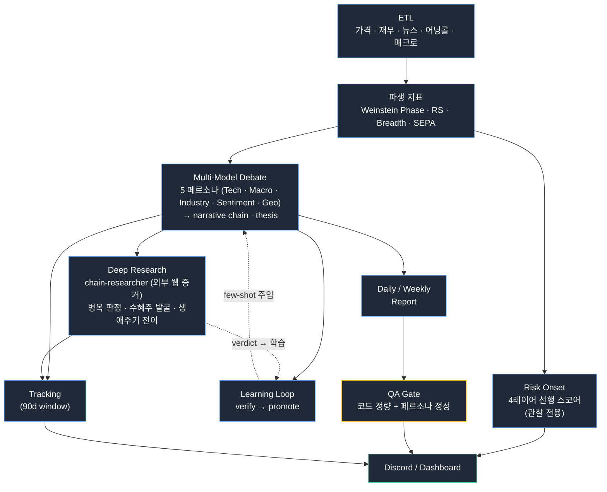

# Market Analyst

**Claude Agent 기반 자율 운영 알파 생성 시스템.**
주식 시장 데이터를 수집·분석하고, 멀티모델 에이전트 토론으로 시그널을 발굴해, 자동으로 리포트를 발행하고, 자신의 가설을 검증하며 학습하는 시스템이다.

벤치마크(SPY) 대비 모델 포트폴리오의 초과 수익(α) 생성을 단일 목표로 한다.

알파는 온전한 시장 사이클(상승→하락→상승)로만 검증된다고 본다. 그래서 골에 시간 구조를 둔다 — **① 수집 단계**(현 상승 사이클): 측정 인프라를 무결하게 완성하고 학습 데이터를 축적한다. **② 수확 단계**(다음 하락~상승 사이클): 축적한 데이터로 진짜 알파를 선점한다. 지금의 성공 기준은 "알파를 냈는가"가 아니라 "다음 사이클에 학습 가능한 데이터를 무결하게 남겼는가"이다.

---

## 이 프로젝트가 흥미로운 이유

1. **멀티모델 5인 에이전트 토론** — Claude Opus 4.8 / xAI Grok 4.3 / Google Gemini 3.1 Pro Preview / OpenAI Codex CLI(gpt-5.5)를 한 토론장에 묶어 페르소나별로 운영한다. **4개 lineage(Anthropic·xAI·Google·OpenAI)로 분산** — 단일 모델 합의가 아니라 서로 다른 모델의 강점을 페르소나로 배치한 구조. (상세: [docs/agent-system.md](docs/agent-system.md))

2. **자율 운영** — 맥미니 한 대에서 launchd로 20종이 넘는 cron 잡이 돈다. 사람이 손대지 않아도 ETL → 토론 → 리포트 → QA → 학습이 매일 돌아간다. GitHub Issue가 triage되면 별도 cron이 Claude Code CLI로 코드를 작성하고 PR을 만들며, 또 다른 cron이 그 PR을 리뷰한다. (상세: [docs/autonomous-operations.md](docs/autonomous-operations.md))

3. **재귀 학습 루프** — 에이전트가 만든 thesis(검증 가능한 예측)는 시간이 지난 뒤 가격·실적 데이터로 자동 검증된다. CONFIRMED/INVALIDATED 결과는 패턴으로 승격되어 다음 토론에 few-shot으로 주입된다. 시스템은 자신의 과거 적중률을 기억한다.

4. **외부 증거 기반 딥리서치** — 토론이 만든 병목 내러티브(megatrend → bottleneck → 수혜주)는 가설로 끝나지 않는다. 독립 리서치 에이전트(`chain-researcher`)가 Bloomberg·WSJ·SEC 공시·어닝콜을 직접 검색해 병목 지속성을 판정(PERSISTS/WEAKENING/RESOLVED)하고, 새 수혜주를 발굴하며, 다음 병목을 예측한다. 수집 증거는 출처·타임스탬프와 함께 append-only 증거층에 보존되고, WEAKENING이 연속되면 체인 상태가 결정론적 룰로 자동 전이된다. (상세: [docs/agent-system.md](docs/agent-system.md))

5. **QA 3축 채점 + 페르소나 피드백 루프** — 모든 리포트는 코드 기반 정량 채점(성과·분석 품질)과 LLM 페르소나 기반 정성 채점을 통과해야 발행된다. 페르소나 피드백은 다음 주간 에이전트 프롬프트에 자동 주입된다.

6. **하락장 선행 감지** — 알파 선점은 결국 다음 하락 사이클을 견디고 그 바닥에서 시작된다. 시스템은 4레이어 합성 리스크 스코어(일드커브 + 금융 스트레스 + 경제 사이클 + 시장 브레드스)로 드로다운 온셋을 선행 감지한다. 금융 스트레스를 주축 트리거로 두어 일드커브 단독 발화를 차단하는 게이트를 건다. 2008(+117일)·2022(+54일) 약세장을 사전 신호로 포착했고 precision 59.6%. 현재는 **관찰·로깅 전용**으로 전략 브리핑과 대시보드에 노출되며, PF 결정 자동 연결은 검증 완료 후로 보류한다 — 미검증 신호를 매매에 연결하지 않는 규율.

7. **5개 도메인 모노레포** — 시그널 발굴 / 포트폴리오 결정 / 자동화 운영 / 운영자 대시보드 / B2C 서비스로 도메인 경계를 명확히 분리. 각 도메인은 PO 에이전트로 추상화되어 사람 조직 체계처럼 동작한다.

---

## 시스템 한눈에 보기

---

## 5개 도메인

| 도메인 | 책임 | 비고 |
|--------|------|------|
| **Analyst** | 시그널 발굴, 5인 토론, thesis, 펀더멘탈 스코어링, narrative chains | Phase 2 주도주 선점 가설 |
| **Portfolio (PM)** | tier 격상/강등, Phase Exit, 편입/청산, 포지션 사이징, 동시 보유 한도 | 현재 L1 룰 기반, L2 LLM 결정 단계 진화 예정 |
| **Operations** | ETL, 리포트 발행, QA 게이트, Issue Processor, PR Reviewer | launchd cron 20+종 |
| **Backoffice** | 운영자 대시보드, 알파 KPI 시각화, 매매일지 UI | Next.js, 자동 빌드·배포 |
| **B2C** | 시장 흐름 가공 데이터 외부 노출 (레이어 A) | 개별 종목 거명 금지 (레이어 B는 가동 전) |

도메인 책임 분리는 PO 에이전트 단위로도 매핑되어 있다. 매니저 에이전트가 미션을 받으면 해당 도메인 PO에 위임하고, PO는 backend/frontend-engineer 같은 실행 에이전트를 디스패치한다.

---

## 자율 운영 스케줄 (요약)

| 작업 | 주기 | 내용 |
|------|------|------|
| ETL Daily | 07:00 화~토 | 데이터 수집 → 파생 지표 → 토론 → 일간 리포트 → QA |
| ETL Weekly | 08:00 일 | 분기 재무·비율 갱신 |
| Agent Weekly | 10:00 토 | 주간 리포트(시장·종목 2건) + 포트폴리오 심사 |
| Chain Researcher | 05:00 금 | 내러티브 병목 딥리서치 (run → apply → evaluate) |
| Strategic Review | 04:00 매일 | 전략 브리핑 자동 갱신 |
| News Collect | 06:45, 18:00 | 매크로/종목 뉴스 |
| Issue Processor | 매 정시 (10:00~02:00, 17회/일) | triaged 이슈 → Claude Code CLI 구현 → PR 생성 |
| PR Reviewer | 매 :30분 (09:30~02:30) | 열린 PR 전수 Strategic + Code 리뷰 |
| Backoffice Health | 5분 | 헬스체크, 다운 시 Discord 알림 |
| Backoffice Deploy | 00:00 매일 | origin/main 변경 감지 시 자동 빌드·배포 |

상세: [docs/autonomous-operations.md](docs/autonomous-operations.md)

---

## 기술 스택

- **런타임**: Node.js 20 (ESM), TypeScript strict
- **DB**: PostgreSQL (Supabase) — 90개 테이블, Drizzle ORM
- **AI**: Claude API (Opus / Sonnet / Haiku), OpenAI Codex CLI, Google Gemini API, Claude Code CLI
- **프론트엔드**: Next.js (App Router), 모노레포 내 단일 backoffice 패키지
- **테스트**: Vitest (80% 커버리지 라인)
- **운영**: macOS launchd, GitHub Actions, Discord Webhook, GitHub CLI
- **외부 데이터**: FMP Ultimate, FRED, Brave Search, RSS

기술 선택 이유와 트레이드오프: [docs/tech-stack.md](docs/tech-stack.md)

---

## 운영 규모

- DB 테이블 90개 (시장 원본 / 파생 지표 / 분석·추천 / 토론·학습 / 리포트·QA / 기업 데이터 / 패턴 / 백테스트)
- 종목 트래킹 윈도우 90일
- 20+종 cron 잡, 7종 리포트 자동 발행 (일간/주간 시장·주간 종목/기업/QA 등)
- specialized agent 20종 (PO, 토론 페르소나, 딥리서치, 실행팀 등)

---

## 상세 문서

- [Architecture](docs/architecture.md) — 5 도메인 / 데이터 플로우 / DB 레이아웃
- [Agent System](docs/agent-system.md) — 멀티모델 토론, thesis 검증, learning loop, QA gate
- [Autonomous Operations](docs/autonomous-operations.md) — 맥미니 launchd, 이슈 프로세서, PR 리뷰어, 매니저-에이전트 조직 체계
- [Tech Stack](docs/tech-stack.md) — 기술 선택 이유와 트레이드오프

---

## 라이선스

MIT — [LICENSE](LICENSE) 참조.

## Author

[@sossost](https://github.com/sossost)
