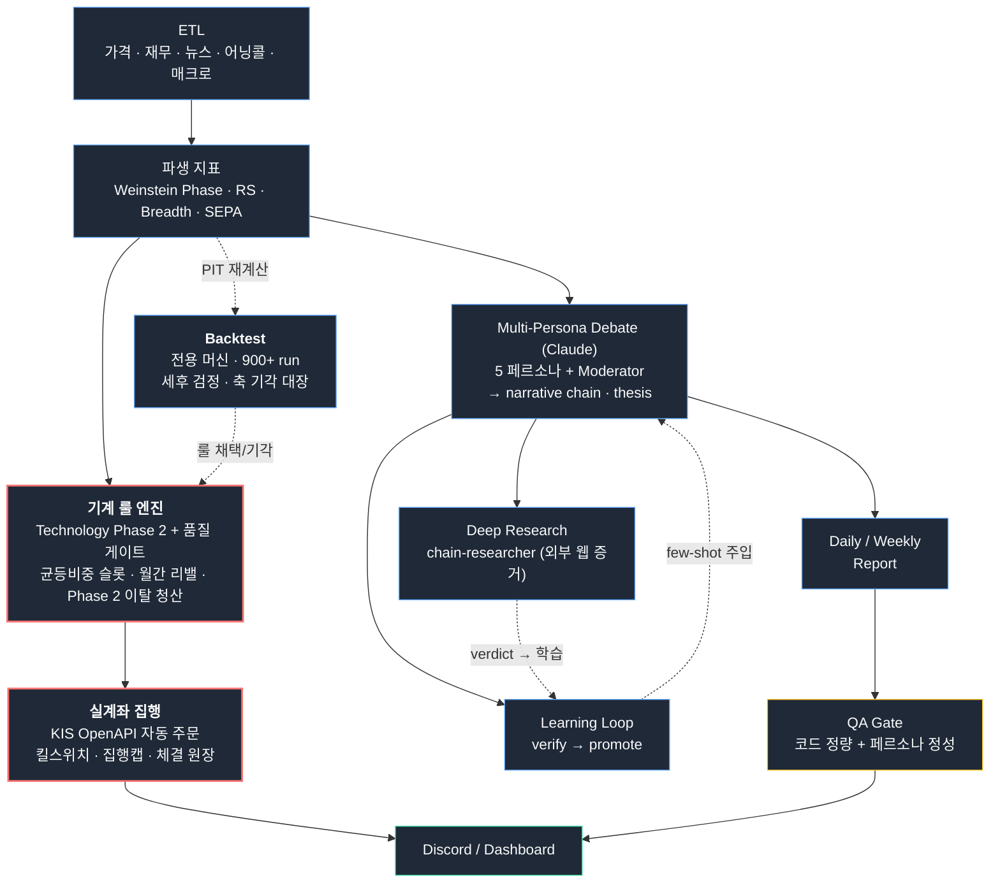

# Market Analyst

**Claude Agent 기반 자율 운영 알파 생성 시스템.**
주식 시장 데이터를 수집·분석하고, 에이전트 토론으로 시장 서사를 구조화하고, 기계 룰로 실계좌를 집행하며, 자신의 가설과 전략 축을 백테스트로 검증하고 기각하는 시스템이다.

벤치마크(**QQQ**) 대비 모델 포트폴리오의 초과 수익(α) 생성을 단일 목표로 한다. SPY(^GSPC) 대비 α는 보조 지표로 병기한다.

> **벤치마크를 SPY에서 QQQ로 바꾼 이유** (2026-08-04): 테크 집중 전략의 SPY 대비 초과분 대부분이 **테크 프리미엄 착시**임이 백테스트로 실증됐다. 같은 구간 벤치마크 NAV가 ^GSPC 372 vs QQQ 678 — 우리가 쓰던 자가 회사 골의 자로 삼기엔 54%짜리였다. 유리한 자를 버리는 것이 첫 번째 규율이다.

알파는 온전한 시장 사이클(상승→하락→상승)로만 검증된다고 본다. 그래서 골에 시간 구조를 둔다 — **① 수집 단계**(현 상승 사이클): 측정 인프라를 무결하게 완성하고 학습 데이터를 축적한다. **② 수확 단계**(다음 하락~상승 사이클): 축적한 데이터로 진짜 알파를 선점한다. 지금의 성공 기준은 "알파를 냈는가"가 아니라 "다음 사이클에 학습 가능한 데이터를 무결하게 남겼는가"이다.

---

## 이 프로젝트가 흥미로운 이유

1. **기계 룰이 실계좌를 집행한다** — 2026-08-04에 한국투자증권 OpenAPI로 미국 주식 실계좌 자동 집행을 개시했다. 진입 후보 스크리닝 → 마감 30분 전 재검증 → 지정가 주문 → 개장 직후 체결 확인 → 상태 전이가 launchd cron으로 무인 구동된다. 다만 **주문 발행의 최종 게이트는 사람이 쥔 킬스위치**이며, 잠근 동안에도 관측·원장·감시 잡은 계속 돈다. **LLM은 이 경로에 한 줄도 개입하지 않는다.** 안전장치(킬스위치·건당/일간 집행 캡·중복 주문 가드·모호 주문 fail-closed)는 전부 DB 단일 SSOT로 봉인되어 있고, 감사 원장이 append-only로 남는다. (상세: [docs/live-execution.md](docs/live-execution.md))

2. **멀티모델 토론을 만들었고, 그리고 폐기했다** — 한때 Claude·Grok·Gemini·Codex 4개 lineage를 페르소나로 배치한 토론 엔진을 돌렸다. 2026-08-15에 **전부 Claude로 단일화**했다. 이유는 성능이 아니라 정직한 회계였다 — 토론 산출물이 실계좌 진입·청산에 기여하는 비율이 **0**이라는 것이 확인되자, 외부 유료 API 지출을 알파에 연결할 근거가 사라졌다. 좋아 보이는 설계를 스스로 기각한 기록이 남아 있다. (상세: [docs/agent-system.md](docs/agent-system.md))

3. **백테스트가 전략을 채택하는 것보다 기각하는 데 더 쓰인다** — 전용 머신에서 900개 이상의 바스켓 시뮬레이션을 돌렸고, 그 결과 대부분은 "이 축은 안 된다"였다. 낙폭 방어 7종·자산배분 사다리·꼴찌 교체·주봉 편출·RS 로테이션 — 전부 기각. 기각 근거는 [전략 연구 대장]에 날짜·run·표본과 함께 한 줄씩 남는다. 남기지 않으면 다음 세션이 같은 축을 다시 판다(실제로 이미 기각된 검정을 26시간 재실행한 사고가 있었다). (상세: [docs/backtest-research.md](docs/backtest-research.md))

4. **세전으로 이겨도 세후에서 지면 기각한다** — 해외주식 양도세는 손실 이월이 안 된다. 그래서 실현을 앞당기는 장치(노출 방어·잦은 리밸런싱)는 세전 최적이 세후에서 그대로 뒤집힌다. 실측: 어떤 방어 구성은 위험조정 수익(Sharpe)으로 무방어를 처음으로 넘겼는데, 세후로는 **−46.7%**였다 — 자산이 27% 적은데 세금은 더 냈다. 방어 이벤트가 10.7배라 실현이 계속 일어난 탓이다. 회전을 바꾸는 축은 세후 검정 없이는 채택도 기각도 못 한다는 규칙을 코드로 강제한다.

5. **자율 운영** — 맥미니 한 대에서 launchd cron **42종**이 돈다. 사람이 손대지 않아도 ETL → 토론 → 리포트 → QA → 학습 → 실집행이 매일 돌아간다. GitHub Issue가 triage되면 별도 cron이 Claude Code CLI로 코드를 작성하고 PR을 만들며, 또 다른 cron이 그 PR을 리뷰한다. (상세: [docs/autonomous-operations.md](docs/autonomous-operations.md))

6. **재귀 학습 루프** — 에이전트가 만든 thesis(검증 가능한 예측)는 시간이 지난 뒤 가격·실적 데이터로 자동 검증된다. CONFIRMED/INVALIDATED 결과는 패턴으로 승격되어 다음 토론에 few-shot으로 주입된다. 다만 이 루프의 위치는 재정의됐다 — **적중률은 관측 지표이지 알파 병목이 아니다**(실계좌가 참조하지 않으므로). 지표를 1급에서 강등시킨 것도 기록으로 남긴다.

7. **외부 증거 기반 딥리서치** — 토론이 만든 병목 내러티브(megatrend → bottleneck → 수혜주)는 가설로 끝나지 않는다. 독립 리서치 에이전트(`chain-researcher`)가 외부 웹을 직접 검색해 병목 지속성을 판정(PERSISTS/WEAKENING/RESOLVED)하고, 수집 증거는 출처·타임스탬프와 함께 append-only 증거층에 보존된다. 이 트랙에도 **기한부 킬 게이트**가 걸려 있다 — 정해진 날짜에 표본이 문턱을 못 넘으면 자동 종료된다.

8. **관측 인프라를 기능보다 먼저 만든다** — 방어 신호를 켜기 전에 신호 히스토리부터 쌓고, 진입 후보를 화면에 띄우기 전에 스크리닝 결과부터 박제하고, 라이브 트랙을 늘리기 전에 관제탑부터 만든다. 사후 재구성이 구조적으로 불가능한 데이터(라이브 overwrite 테이블, 슬롯 회계)를 매일 PIT 스냅샷으로 남기는 잡이 여러 개 돈다.

---

## 시스템 한눈에 보기

```mermaid
flowchart TB
    ETL["ETL<br/>가격 · 재무 · 뉴스 · 어닝콜 · 매크로"]
    DERIVED["파생 지표<br/>Weinstein Phase · RS · Breadth · SEPA"]
    RULE["<b>기계 룰 엔진</b><br/>Technology Phase 2 + 품질 게이트<br/>균등비중 슬롯 · 월간 리밸 · Phase 2 이탈 청산"]
    EXEC["<b>실계좌 집행</b><br/>KIS OpenAPI 자동 주문<br/>킬스위치 · 집행캡 · 체결 원장"]
    DEBATE["Multi-Persona Debate (Claude)<br/>5 페르소나 + Moderator<br/>→ narrative chain · thesis"]
    RESEARCH["Deep Research<br/>chain-researcher (외부 웹 증거)"]
    REPORT["Daily / Weekly<br/>Report"]
    LEARN["Learning Loop<br/>verify → promote"]
    BT["<b>Backtest</b><br/>전용 머신 · 900+ run<br/>세후 검정 · 축 기각 대장"]
    QA["QA Gate<br/>코드 정량 + 페르소나 정성"]
    OUT["Discord / Dashboard"]

    ETL --> DERIVED
    DERIVED --> RULE
    RULE --> EXEC
    DERIVED --> DEBATE
    DEBATE --> RESEARCH
    DEBATE --> REPORT
    DEBATE --> LEARN
    RESEARCH -. verdict → 학습 .-> LEARN
    LEARN -. few-shot 주입 .-> DEBATE
    BT -. 룰 채택/기각 .-> RULE
    DERIVED -. PIT 재계산 .-> BT
    EXEC --> OUT
    REPORT --> QA
    QA --> OUT

    classDef stage fill:#1f2937,stroke:#60a5fa,color:#f9fafb,stroke-width:1px
    classDef money fill:#1f2937,stroke:#f87171,color:#f9fafb,stroke-width:2px
    classDef gate fill:#1f2937,stroke:#fbbf24,color:#f9fafb,stroke-width:1px
    classDef out fill:#1f2937,stroke:#34d399,color:#f9fafb,stroke-width:1px
    class ETL,DERIVED,DEBATE,RESEARCH,REPORT,LEARN,BT stage
    class RULE,EXEC money
    class QA gate
    class OUT out
```

**빨간 경로가 돈이 흐르는 경로다.** 토론·딥리서치·학습 루프는 리포트 콘텐츠와 서사 구조를 생산하며, 실계좌 진입·청산에는 관여하지 않는다. 이 경계를 문서·코드·테스트 세 곳에서 고정한다 — 실행 파일에 토론 산출물 테이블 참조가 들어오면 계약 테스트가 깨진다.

---

## 5개 도메인

| 도메인 | 책임 | 비고 |
|--------|------|------|
| **Analyst** | 시그널 발굴, 5인 토론, thesis, 펀더멘탈 스코어링, narrative chains, 백테스트 재계산 | Phase 2 주도주 선점 가설 |
| **Portfolio (PM)** | 진입/청산 룰, 포지션 사이징, 리밸런싱, 브로커 집행 상태머신 | 실계좌 집행 트랙 운영 (킬스위치가 최종 게이트) |
| **Operations** | ETL, 리포트 발행, QA 게이트, Issue Processor, PR Reviewer, 집행 잡 무중단 감시 | launchd cron 42종 |
| **Backoffice** | 운영자 대시보드, 알파 KPI 시각화, 실집행 관제탑(`/pf2-live`) | Next.js, 자동 빌드·배포 |
| **B2C** | 시장 흐름 가공 데이터 외부 노출 (레이어 A + 코크핏) | 개별 종목 거명 금지 (레이어 B는 성과 게이트 종속) |

도메인 책임 분리는 PO 에이전트 단위로도 매핑되어 있다. 매니저 에이전트가 미션을 받으면 해당 도메인 PO에 위임하고, PO는 backend/frontend-engineer 같은 실행 에이전트를 디스패치한다.

---

## 자율 운영 스케줄 (요약)

| 작업 | 주기 | 내용 |
|------|------|------|
| ETL Daily | 화~토 | 데이터 수집 → 파생 지표 → 토론 → 일간 리포트 → QA |
| 진입 후보 선정 | 화~토 | Phase 2 유니버스 스크리닝 + 후보 스냅샷 박제 |
| 주문 예약 (T7a) | 화~토 (미국 마감 30분 전) | 실시간 재검증 → 지정가 주문 → RESERVED |
| 체결 확인 (T7b) | 화~토 (개장 직후) | 체결가 원자적 기록 → ACTIVE / EXITED |
| 월간 리밸런싱 | 매월 | 슬롯 재배분 + 승자 부분매도(트림) 결정 |
| 집행 감시 Sentinel | 상시 | launchd 등록·freshness 무중단 감시, 이탈 시 CRITICAL 알림 |
| Agent Weekly | 주 1회 | 주간 리포트(시장·종목 2건) + 포트폴리오 심사 |
| Chain Researcher | 주 1회 | 내러티브 병목 딥리서치 (run → apply → evaluate) |
| Strategic Review | 매일 04:00 | 전략 브리핑 자동 갱신 |
| Issue Processor | 매 정시 (일 13회) | triaged 이슈 → Claude Code CLI 구현 → PR 생성 |
| PR Reviewer | 매 :30분 (일 18회) | 열린 PR 전수 Strategic + Code 리뷰 |
| Backoffice Health | 5분 | 헬스체크, 다운 시 Discord 알림 |

상세: [docs/autonomous-operations.md](docs/autonomous-operations.md)

---

## 기술 스택

- **런타임**: Node.js 20 (ESM), TypeScript strict
- **DB**: PostgreSQL (Supabase) — **146개 테이블**, Drizzle ORM, 번호순 SQL 마이그레이션
- **AI**: Claude API (Opus / Sonnet / Haiku), Claude Code CLI (코드 작성·리뷰·딥리서치)
- **브로커**: 한국투자증권 OpenAPI (실계좌 집행), 토스증권 OpenAPI (트랙 보존, 홀딩)
- **프론트엔드**: Next.js (App Router) — backoffice / b2c / cap3-dashboard
- **테스트**: Vitest — 테스트 파일 800개+, 13,000건+ (푸시 훅이 전건 통과를 강제)
- **운영**: macOS launchd (3대), GitHub Actions, Discord Webhook, GitHub CLI
- **외부 데이터**: FMP Ultimate, FRED, Brave Search, RSS

기술 선택 이유와 트레이드오프: [docs/tech-stack.md](docs/tech-stack.md)

---

## 운영 규모

- DB 테이블 **146개** (시장 원본 / 파생 지표 / 분석·추천 / 토론·학습 / 리포트·QA / 기업 데이터 / 패턴 / 백테스트 / 브로커 집행)
- launchd cron **42종**, 머신 3대 (운영 · 백테스트 전용 · 개발)
- 백테스트 바스켓 시뮬레이션 **900+ run**
- 리포트 8종 자동 발행 (일간 / 일간 초보자용 / 주간 시장 / 주간 종목 / 기업 / QA / 포트폴리오 다이제스트 / 공개 페이퍼 대시보드)
- specialized agent **20종** (PO, 토론 페르소나, 딥리서치, 실행팀 등)
- 모노레포 패키지 7개 (analyst / portfolio / ops / backoffice / b2c / cap3-dashboard / shared)

---

## 상세 문서

- [Architecture](docs/architecture.md) — 5 도메인 / 데이터 플로우 / DB 레이아웃
- [Live Execution](docs/live-execution.md) — 실계좌 자동 집행 상태머신, 안전장치, 다계좌 격리
- [Backtest & Research](docs/backtest-research.md) — 전용 머신, 비교가능성 계약, 세후 검정 의무, 기각 대장
- [Agent System](docs/agent-system.md) — 토론 엔진(과 그 축소), thesis 검증, learning loop, QA gate
- [Autonomous Operations](docs/autonomous-operations.md) — launchd, 이슈 프로세서, PR 리뷰어, 매니저-에이전트 조직 체계
- [Tech Stack](docs/tech-stack.md) — 기술 선택 이유와 트레이드오프

---

## 라이선스

MIT — [LICENSE](LICENSE) 참조.

## Author

[@sossost](https://github.com/sossost)
