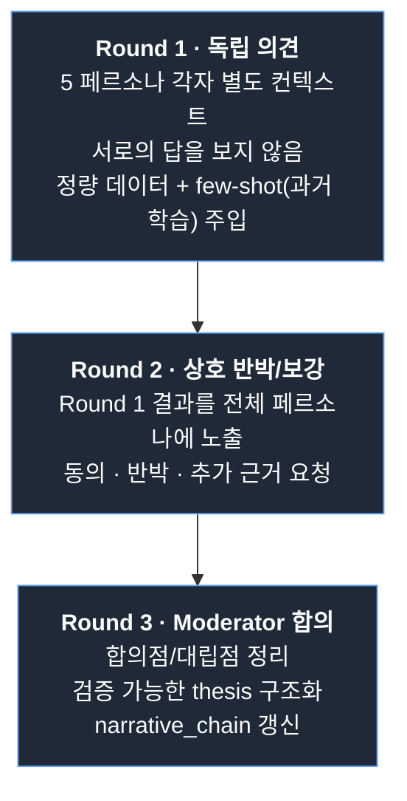
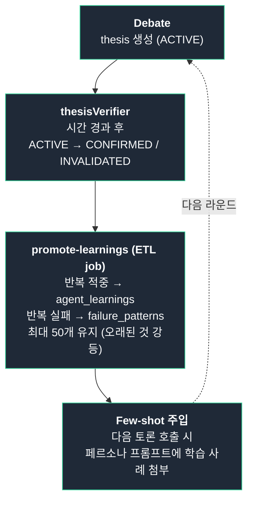
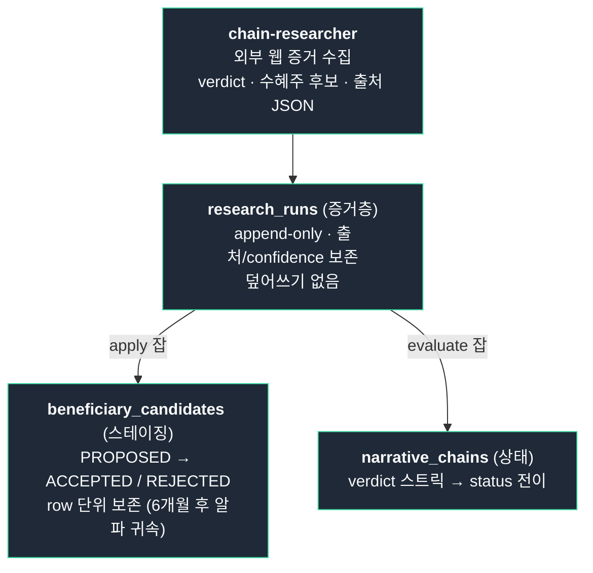
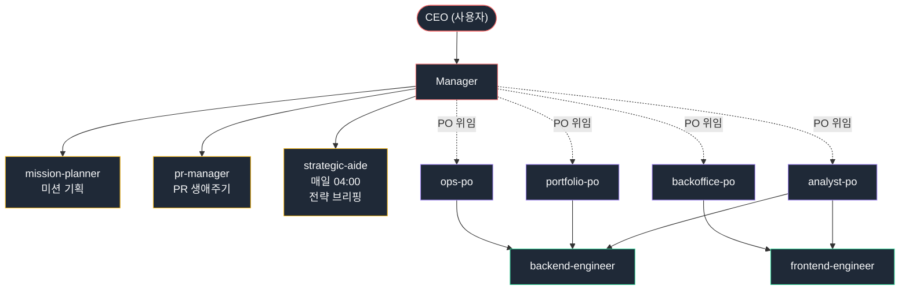

# Agent System

이 시스템의 핵심은 **여러 AI 모델을 페르소나로 배치한 토론 엔진**과, **자기 가설을 검증해 다음 토론에 반영하는 학습 루프**다.

---

## 멀티모델 5인 토론

### 왜 단일 모델이 아닌가

단일 모델로 여러 페르소나를 흉내내면 톤만 다를 뿐 사고 패턴은 같아진다. 모델마다 강점이 다르다는 점을 이용해, **모델 자체를 페르소나에 매핑**했다.

### 페르소나 구성

| 페르소나 | 책임 | 모델 |
|---------|------|------|
| Tech Analyst | RS·Phase·브레드스 기반 기술적 분석 | xAI Grok 4.3 |
| Macro Economist | 금리/유동성/매크로 지표 해석 | Claude Opus 4.8 |
| Industry Analyst | 업종/공급망/병목 분석 | Claude Opus 4.8 |
| Sentiment Analyst | 뉴스/심리/내러티브 추적 | OpenAI Codex CLI (gpt-5.5 계열) |
| Geopolitics | 지정학·정책 국면 해석 | Google Gemini 3.1 Pro Preview |
| Moderator | 3R 종합 + thesis 구조화 | Claude Opus 4.8 |

**5개 토론 페르소나 + 1개 Moderator = 4개 lineage (Anthropic·xAI·Google·OpenAI)** — 단일 모델 합의 회피 + 도메인별 강점 매칭.

Tech Analyst(Grok 4.3)는 RS·Phase 등 정량 지표와 함께 제공된 정성 신호(어닝콜 하이라이트·경영진 가이던스·수요 언급·뉴스)를 페어링해 "왜 지금"의 인과를 짚는다. **환각 가드**: 이 파이프라인에서 Grok은 실시간 X/웹 검색 권한이 없으므로, 제공된 컨텍스트에 실재하는 출처만 인용하고 없으면 "관련 정성 신호 미제공"으로 표기한다. 존재하지 않는 출처를 날조하는 것을 구조적으로 차단한다.

### 토론 구조

토론 결과는 `debate_sessions` 테이블에 라운드별로 저장된다. 모든 출력이 보존되므로 사후에 어떤 페르소나가 어떤 시점에 무엇을 말했는지 추적 가능.

### Round 1에 주입되는 정량 신호

페르소나의 의견은 감(感)이 아니라 ETL이 매일 계산한 정량 스냅샷 위에서 만들어진다. Round 1 컨텍스트에 주입되는 촉매 데이터:

- 섹터/업종 비트율 (Phase 2 비율, RS 분포)
- 종목 RS 4주 추세
- 수요 회복 신호 + 어닝콜 + 뉴스
- **RS와 무관하게 거래량을 동반해 자금이 유입되는 업종** — 가격 돌파가 RS 퍼센타일에 반영되기 *이전*의 선행 신호. ETL의 거래량 동반 돌파 롤업(`industry_rs_daily`에 업종별 `confirmed_breakout_count` / `vol_surge_count` 집계)이 산출하며, RS가 아직 낮아 일반 게이트로는 안 잡히는 사이클 초입 업종을 토론장에 올린다.

---

## Thesis: 검증 가능한 예측

토론의 산출물은 의견이 아니라 **검증 가능한 예측**이다.

각 thesis는 다음을 가진다:

- 명시적 가설 ("AI 인프라 사이클 진입, 반도체 장비 업종 1~2분기 내 RS 70 돌파")
- 검증 시점 (특정 날짜 또는 트리거 조건)
- 검증 메트릭 (RS 임계값, 가격 변동, 실적 지표)
- 상태: `ACTIVE` / `HYPOTHESIS` / `CONFIRMED` / `INVALIDATED` / `EXPIRED`
- 연결된 국면 FK (geopolitical_regimes, policy_regimes) — 어떤 매크로 전제 위에서 만든 가설인지 추적
- 수혜 종목 매핑 (narrative_chains.beneficiaryTickers)

### 자동 검증

`thesisVerifier`가 매일 ACTIVE thesis를 스캔해 검증 조건을 평가한다.

- 만료일 도래 + 조건 미충족 → `INVALIDATED` 또는 `EXPIRED`
- 조건 충족 → `CONFIRMED`
- HOLD 임계 초과 stale thesis 자동 만료
- 2일 연속 grace period 적용으로 단기 노이즈에 의한 조기 청산 방지
- **pillar-scorecard 포맷** — 단일 충족/미충족 이진 판정이 아니라, thesis를 구성하는 근거 기둥(pillar)별로 현재 시장 데이터가 어디까지 부합하는지 채점한다. 부분 확인/부분 반증 상태를 보존해 조기 INVALIDATED를 줄이고, 어떤 전제가 깨졌는지 추적 가능

검증 결과는 단순한 라벨이 아니다. **다음 토론의 few-shot 입력**이 된다.

---

## Learning Loop

검증된 thesis와 패턴은 시스템의 장기 기억으로 누적된다.

이 루프 덕에 시스템은 시간이 지날수록 **자신이 어떤 종류의 가설에 강하고 약한지** 학습한다. 새로 만든 thesis가 과거 실패 패턴과 매칭되면 토론 단계에서 자동으로 경고가 발생한다.

---

## Deep Research — 외부 증거로 내러티브 검증

토론은 "AI 인프라 사이클의 병목은 HBM 메모리" 같은 **내러티브 체인**(megatrend → bottleneck → 수혜주)을 만든다. 하지만 이건 모델 내부 지식에 기반한 가설일 뿐이다. 병목이 지금도 유효한지, 누가 진짜 수혜를 보는지는 **외부 실시간 증거**로 확인해야 한다.

이 역할을 토론 페르소나와 분리된 독립 에이전트 `chain-researcher`(Sonnet)가 맡는다.

### 토론 페르소나와 무엇이 다른가

| | 5인 토론 페르소나 | chain-researcher |
|---|---|---|
| 입력 | DB 정량 데이터 + few-shot | 병목 체인 1개 + 보유 데이터(어닝콜/뉴스) |
| 도구 | 없음 (내부 추론) | WebSearch · WebFetch (외부 증거) |
| 출력 | 의견 → 합의 → thesis | 구조화 JSON (verdict + 출처 + 수혜주 후보) |
| 호출 | debate 엔진 | `run-chain-researcher.ts` 잡이 CLI로 호출 |

### 무엇을 산출하는가

체인 하나를 받아 외부 증거를 수집하고 세 가지를 판정한다.

1. **병목 지속성** — `PERSISTS` / `WEAKENING` / `RESOLVED`. 증산 발표·대체 공급망 등 해소 신호를 근거로 판정.
2. **수혜주 발굴·확장** — 현재 병목에 직접 노출된 기업만 후보로 발굴 (다음 병목 수혜는 제외하고 텍스트로만 서술).
3. **다음 병목 예측** — 이 병목이 풀리면 어디로 이동할지.

모든 주장에는 출처 URL + 발행 타임스탬프가 강제된다. Bloomberg·WSJ·SEC 공시는 confidence 상향, 소셜/익명 소스만 있으면 confidence 0.3 미만으로 기록되어 후속 잡이 자동 기각한다.

### 3층 분리 — 증거 / 스테이징 / 상태

리서치 결과를 체인 본체에 바로 덮어쓰지 않는다. 알파 귀속을 사후 측정할 수 있도록 증거를 보존한다.

### 생애주기 전이 — verdict 히스테리시스

단발 verdict로 체인 상태를 바꾸지 않는다. 노이즈에 흔들리지 않도록 **연속 판정**을 요구하는 히스테리시스를 적용한다.

- `evaluate-chain-lifecycle` 잡이 미평가 run을 오래된 순서로 fold
- 예: `WEAKENING` 2회 연속 → 체인 `ACTIVE` → `RESOLVING` 전이
- **LLM 호출 없는 결정론적 룰** — 같은 입력은 같은 결과
- 각 run은 `lifecycleEvaluatedAt` 마커로 정확히 1회만 스트릭에 반영 (재실행 안전, idempotent)

### 체인 데이터 무결성 다층 가드

히스테리시스만으로는 충분하지 않다. 체인 데이터 자체가 노이즈로 오염되지 않도록 여러 계층의 가드를 운영한다.

- **중복 병합(dedup)** — 동일 병목을 서로 다른 이름으로 가리키는 체인을 자동 탐지·병합
- **수혜주 인과 단절 경보** — 수혜주와 병목 체인 사이의 인과 연결이 끊어졌을 때 warn-only 경보. 즉시 삭제가 아닌 관찰로 오탐지를 방지
- **신규 INSERT 필수 필드 검증** — `capacity`(물리·기술 용량 부족) / `regulatory`(규제·정책 인위적 희소성) 타입별 필수 필드의 실재를 INSERT 시점에 확인. 타입 정의만 있고 내용이 없는 껍데기 체인을 차단
- **생존율 KPI 분모 정합** — `INVALIDATED` 비율을 생존율 KPI 분모에 반영할 때, 레거시 비-병목 체인과 중복 병합된 체인을 제외한다. 이렇게 해야 `INVALIDATED`가 "진짜 병목이 소멸된 경우"만 집계되어 KPI가 왜곡되지 않는다.

토론이 가설을 세우고 → 딥리서치가 외부 증거로 검증하고 → 검증 결과가 다시 토론의 few-shot으로 돌아온다. 학습 루프가 가격·실적이라는 *시장 결과*로 닫힌다면, 딥리서치 루프는 *외부 사실*로 닫힌다.

### 공급망 추론 정확도 계측 — 생존편향 보정

내러티브 체인(공급망 병목 → 수혜주) 추론이 사후에 얼마나 맞았는지 계측한다. 활성 종목만 분석하면 살아남은 종목만 보게 되므로, **상장폐지(delisted) 종목까지 포함**해 historical 적중률을 측정한다. 이를 통해 딥리서치 에이전트의 수혜주 발굴 정밀도를 생존편향 없이 추적한다.

---

## QA Gate — 발행 전 3축 채점

리포트는 작성되었다고 바로 발행되지 않는다. 3축 채점을 통과해야 한다.

| 축 | 채점 방식 | 측정 대상 |
|----|---------|---------|
| 성과 축 | 코드 (정량) | 과거 추천의 누적 PnL, 적중률, drawdown |
| 분석 품질 축 | 코드 (정량) | 데이터 일관성, thesis 검증 비율, 모집단 sanity check |
| 리포트 품질 축 | LLM (페르소나) | 논리 흐름, 근거 명시, 톤, 모순 검출 |

### 임계값 정책

- `daily_qa_reports.severity`: `ok` / `warn` / `block`
- `block` 시 발행 차단 + GitHub Discussions Alert 자동 게시
- mismatches는 JSONB로 저장되어 어디서 어떤 사실이 어긋났는지 보존

### 데이터 무결성 가드 — breadth 모집단 결손 감지

전체 종목 모집단(`total_stocks`)이 전일 대비 10% 이상 급감하면 Phase 2 비율이 역방향으로 착시 상승하는 문제가 생긴다(분모가 줄어드는 효과). 이를 자동 감지해 `population_deficiency_pct`(결손 비율)와 `is_population_deficient`(10% 초과 여부) 플래그로 마킹하고, 주간 QA가 해당 날짜의 브레드스 지표를 감시한다. 측정 인프라가 데이터 수집 문제를 시그널 품질 문제로 오인하지 않도록 보호하는 계층이다.

### 페르소나 피드백 루프

리포트 품질 축의 페르소나 피드백은 **다음 주간 에이전트의 시스템 프롬프트에 자동 주입**된다. 같은 실수를 두 번 하지 않게 하는 가장 단순하지만 강력한 메커니즘.

예: "지난주 리포트에서 섹터 RS 변동을 일간 단위로 봤다가 노이즈로 판정됐다. 4주 변화로 보라" 같은 메모가 다음 주에 자동으로 첨부된다.

---

## 매니저 + 에이전트 조직 체계

엔지니어링 작업 자체도 에이전트 체계로 운영된다.

### 동작 원리

1. CEO가 미션 부여 → 매니저는 즉시 코딩하지 않음
2. `mission-planner`에 위임 → 기획서 생성 (기획서 없이 구현 금지)
3. 매니저가 기획서 검증 (불필요한 제약, 타이밍 충돌, 근거 없는 숫자 체크)
4. PO 위임 또는 매니저 직접 디스패치 결정
5. 실행 에이전트 디스패치 (독립 작업은 병렬)
6. `code-reviewer` 실행, CRITICAL/HIGH 수정
7. `pr-manager`에 위임해 PR 생성 (직접 `gh pr create` 금지)
8. CEO 명시적 지시 시에만 머지

이 체계 자체가 코드 베이스에 prompt 파일로 정의되어 있고, Claude Code CLI가 매 세션에서 자동 로드한다.

총 specialized agent 20종. 토론 페르소나 5종 + 직속 3종 + PO 4종 + 실행팀 + 딥리서치(chain-researcher) + QA·data viz 등.

---

## 어필 포인트 요약

- **모델 다양성을 페르소나로 활용** — 단일 모델 합의가 아닌, 서로 다른 모델의 강점을 페르소나로 배치
- **모델별 제약을 인지한 출처 무결성** — Grok은 이 파이프라인에서 실시간 검색 불가. 제공된 컨텍스트에 실재하는 출처만 인용하도록 구조적으로 강제
- **자기 검증** — thesis 자동 검증으로 시스템이 자신의 적중률을 정량 추적
- **외부 사실 검증** — 독립 딥리서치 에이전트가 외부 웹 증거로 내러티브를 검증하고 출처와 함께 보존
- **생존편향 보정 계측** — 공급망 추론 적중률을 상장폐지 종목까지 포함해 측정
- **자기 학습** — 검증 결과가 다음 토론 few-shot으로 자동 주입
- **자기 품질 통제** — QA gate가 발행을 차단하고, 페르소나 피드백이 프롬프트를 개선
- **데이터 무결성 다층 가드** — breadth 모집단 결손 감지, 체인 중복 병합, 수혜주 인과 단절 경보 등 노이즈 오염 차단
- **자기 운영** — 엔지니어링 작업까지 에이전트 조직으로 운영 (다음 문서 참조)
