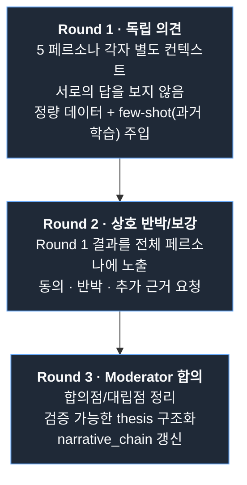
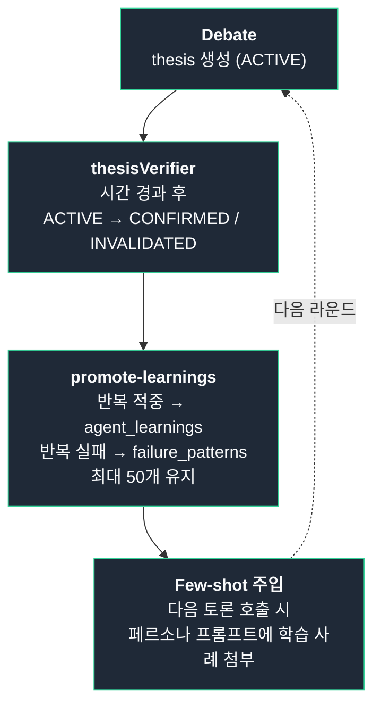
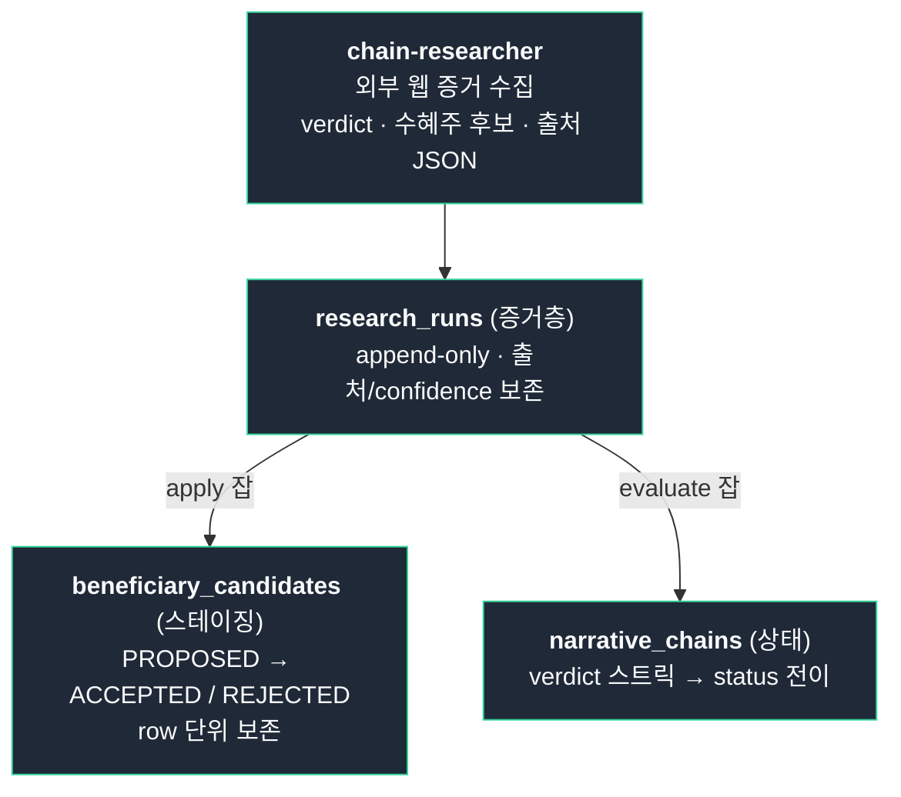
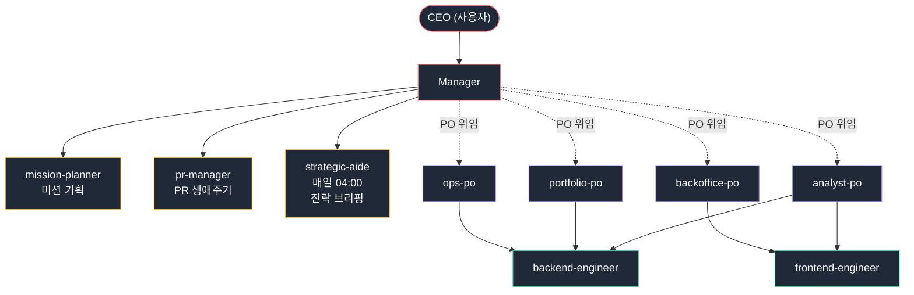

# Agent System

이 시스템의 에이전트 층은 **시장 서사를 구조화하는 토론 엔진**, **자기 가설을 검증해 다음 토론에 반영하는 학습 루프**, 그리고 **엔지니어링 작업 자체를 수행하는 조직 체계**로 나뉜다.

> **먼저 위치를 밝힌다.** 토론·thesis·내러티브 체인의 산출물은 **리포트 콘텐츠와 서사 구조**다. 실계좌 진입·청산은 기계 룰 단독이며 이 산출물을 참조하지 않는다([Live Execution](live-execution.md) 참조). 이 경계를 흐리면 "적중률이 알파 병목"이라는 잘못된 진단으로 이어진다.

---

## 5인 토론 — 그리고 멀티모델을 폐기한 이유

### 우리가 했던 것

한때 토론 페르소나마다 **다른 회사의 모델**을 배치했다. Claude(macro·industry·moderator), xAI Grok(tech), Google Gemini(geopolitics), OpenAI Codex CLI(sentiment) — 4개 lineage. 근거는 "단일 모델로 여러 페르소나를 흉내내면 톤만 다를 뿐 사고 패턴이 같아진다"였고, 이건 지금도 틀린 말은 아니라고 본다.

### 왜 버렸나

2026-08-15에 **6개 역할 전부 Claude로 단일화**했다.

기술적 실패 때문이 아니다. **회계 때문이다.** 토론 산출물이 라이브 돈 경로에 기여하는 비율을 정직하게 측정했더니 **0**이었다 — 실계좌는 기계 룰로만 돌아가고, 토론은 리포트와 서사를 만든다. 그러면 외부 유료 API 지출을 알파에 연결할 근거가 없다.

프로바이더 다양성이 확증편향을 완화한다는 설계 근거는 **폐기**로 기록했다. 편향 완화 역할은 moderator 종합 + Round 2 상호 반박이 대체한다. 외부 프로바이더 코드는 휴면 상태로 보존하되, 되돌리려면 근거와 함께 명시적으로 표를 고쳐야 한다.

### 그 뒤에 일어난 사고 — 조용한 강등

단일화 리팩터링 과정에서, 그때까지 런타임에 **무시되던** 마크다운 frontmatter의 모델 지정이 갑자기 실효화됐다. 그 결과 3개 페르소나가 아무도 결정하지 않았는데 opus → sonnet으로 강등됐다.

- 어느 커밋에도 강등 결정이 없다. **리팩터링 부수효과**였다.
- validator 실패 0건, fallback 0건 — **건강도 계측은 전부 초록**이었다.
- **10일간 무탐지.** 발견은 "토론 산출 품질이 왜 떨어졌지?"라는 의문에서 시작됐다.

수정은 두 가지였다. ① 모델 티어를 **코드 한 곳에서 선언**하고 마크다운이 그것을 따라오게 한다. ② 두 선언의 불일치를 **드리프트 가드 테스트**로 막는다 — 한쪽만 고치면 테스트가 깨져 리뷰가 걸린다. 조용한 티어 변경 경로는 이것으로 닫혔다.

여기에 산출 품질 회귀 감시를 추가했다. "잡이 돌았는가"가 아니라 **"쓸 만한 것을 냈는가"**를 본다 — 세션당 thesis 수율, 토큰 효율, 유효 모델 티어, 무산출 세션 비율을 직전 6세션 대 그 앞 6세션의 변화율로 감시한다.

### 현재 페르소나 구성

| 페르소나 | 책임 |
|---------|------|
| Macro Economist | 금리 / 유동성 / 매크로 지표 해석 |
| Tech Analyst | RS · Phase · 브레드스 기반 기술적 분석 |
| Industry Analyst | 업종 / 공급망 / 병목 분석 |
| Sentiment Analyst | 뉴스 / 심리 / 내러티브 추적 |
| Geopolitics | 지정학 · 정책 국면 해석 |
| Moderator | 3R 종합 + thesis 구조화 |

6개 역할 전원 Claude Opus.

### 토론 구조

```mermaid
flowchart TB
    R1["<b>Round 1 · 독립 의견</b><br/>5 페르소나 각자 별도 컨텍스트<br/>서로의 답을 보지 않음<br/>정량 데이터 + few-shot(과거 학습) 주입"]
    R2["<b>Round 2 · 상호 반박/보강</b><br/>Round 1 결과를 전체 페르소나에 노출<br/>동의 · 반박 · 추가 근거 요청"]
    R3["<b>Round 3 · Moderator 합의</b><br/>합의점/대립점 정리<br/>검증 가능한 thesis 구조화<br/>narrative_chain 갱신"]

    R1 --> R2 --> R3

    classDef round fill:#1f2937,stroke:#60a5fa,color:#f9fafb
    class R1,R2,R3 round
```

토론 결과는 라운드별로 DB에 보존된다. 실행 메타(모델 티어·토큰·산출 수)도 함께 박제되므로, 사후에 "어떤 페르소나가 어떤 모델로 언제 무엇을 말했는지" 추적 가능하다.

### Round 1에 주입되는 정량 신호

페르소나의 의견은 감(感)이 아니라 ETL이 매일 계산한 정량 스냅샷 위에서 만들어진다.

- 섹터/업종 비트율 (Phase 2 비율, RS 분포)
- 종목 RS 4주 추세
- 수요 회복 신호 + 어닝콜 + 뉴스
- **RS와 무관하게 거래량을 동반해 자금이 유입되는 업종** — 가격 돌파가 RS 퍼센타일에 반영되기 *이전*의 선행 신호. RS가 아직 낮아 일반 게이트로는 안 잡히는 사이클 초입 업종을 토론장에 올린다.

---

## Thesis: 검증 가능한 예측

토론의 산출물은 의견이 아니라 **검증 가능한 예측**이다. 각 thesis는 명시적 가설·검증 시점·검증 메트릭·상태(`ACTIVE` / `HYPOTHESIS` / `CONFIRMED` / `INVALIDATED` / `EXPIRED`)·연결된 국면 FK·수혜 종목 매핑을 가진다.

### 자동 검증

`thesisVerifier`가 매일 ACTIVE thesis를 스캔해 검증 조건을 평가한다.

- 만료일 도래 + 조건 미충족 → `INVALIDATED` 또는 `EXPIRED`
- 조건 충족 → `CONFIRMED`
- 2일 연속 grace period로 단기 노이즈에 의한 조기 청산 방지
- **pillar-scorecard 포맷** — 이진 판정이 아니라 근거 기둥별 채점. 부분 확인/부분 반증 상태를 보존해 어떤 전제가 깨졌는지 추적

### 적중률을 1급 KPI에서 내렸다

원래 성공 기준 1번이 "thesis 적중률 50%+"였다. 지금은 **관측 지표로 강등**했다.

두 가지가 드러났기 때문이다.

1. **돈 경로 기여가 0이다.** 실계좌가 thesis를 참조하지 않으므로, 적중률이 오르든 내리든 알파는 움직이지 않는다. 병목이 아닌 것을 KPI 1번에 두면 자원이 잘못 간다.
2. **적중률 자체가 오염돼 있었다.** 감사해 보니 CONFIRMED의 **75%가 trivial**이었다 — "거의 확실히 일어날 일"을 예측으로 세워 놓고 맞혔다고 집계한 것이다. 이후 판정 시점에 정보량을 자동 채점해 trivial을 분모·분자에서 빼도록 고쳤다.

다만 소급 재분류에는 경계가 있다. 자동 마킹은 CONFIRMED에만 걸고 INVALIDATED에는 걸지 않는다 — 한쪽만 정제하면 그 시점 이후 판정분만 적중률이 **높게** 나오는 낙관 편향이 생기기 때문이다. 그래서 지표를 인용할 때는 **vintage 혼재와 오염 단서를 항상 병기**한다.

---

## Learning Loop

```mermaid
flowchart TB
    D["<b>Debate</b><br/>thesis 생성 (ACTIVE)"]
    V["<b>thesisVerifier</b><br/>시간 경과 후<br/>ACTIVE → CONFIRMED / INVALIDATED"]
    P["<b>promote-learnings</b><br/>반복 적중 → agent_learnings<br/>반복 실패 → failure_patterns<br/>최대 50개 유지"]
    F["<b>Few-shot 주입</b><br/>다음 토론 호출 시<br/>페르소나 프롬프트에 학습 사례 첨부"]

    D --> V --> P --> F
    F -. 다음 라운드 .-> D

    classDef step fill:#1f2937,stroke:#34d399,color:#f9fafb
    class D,V,P,F step
```

### 학습 루프도 오염된다

백테스트 실험용으로 만든 페르소나의 산출물이 학습으로 승격되어, 실제 토론 프롬프트에 "강한 근거"로 주입되고 있었다. 검증 목적의 산출물이 판단 입력으로 새어 들어간 것이다.

4중 방어선을 깔았다 — 승격 입력 필터 / 자가 치유 / **출처 역추적 컬럼 추가 + 소급 정리** / 읽기 시점 드롭. 그리고 학습 승격 행에 **어떤 페르소나가 낸 thesis에서 왔는지**를 정본으로 기록하게 했다. 출처를 남기지 않으면 다음 오염을 또 못 잡는다.

---

## Deep Research — 외부 증거로 내러티브 검증

토론은 "이 사이클의 병목은 X"라는 **내러티브 체인**(megatrend → bottleneck → 수혜주)을 만든다. 이건 모델 내부 지식에 기반한 가설일 뿐이다. 병목이 지금도 유효한지는 **외부 실시간 증거**로 확인해야 한다.

독립 에이전트 `chain-researcher`가 이 역할을 맡는다.

| | 5인 토론 페르소나 | chain-researcher |
|---|---|---|
| 입력 | DB 정량 데이터 + few-shot | 병목 체인 1개 + 보유 데이터 |
| 도구 | 없음 (내부 추론) | WebSearch · WebFetch (외부 증거) |
| 출력 | 의견 → 합의 → thesis | 구조화 JSON (verdict + 출처 + 수혜주 후보) |

산출은 세 가지다 — **병목 지속성**(`PERSISTS`/`WEAKENING`/`RESOLVED`), **수혜주 발굴·확장**, **다음 병목 예측**. 모든 주장에 출처 URL + 발행 타임스탬프가 강제되고, 소셜/익명 소스만 있으면 confidence가 낮게 기록되어 후속 잡이 자동 기각한다.

### 3층 분리 — 증거 / 스테이징 / 상태

```mermaid
flowchart TB
    R["<b>chain-researcher</b><br/>외부 웹 증거 수집<br/>verdict · 수혜주 후보 · 출처 JSON"]
    RUN["<b>research_runs</b> (증거층)<br/>append-only · 출처/confidence 보존"]
    CAND["<b>beneficiary_candidates</b> (스테이징)<br/>PROPOSED → ACCEPTED / REJECTED<br/>row 단위 보존"]
    CHAIN["<b>narrative_chains</b> (상태)<br/>verdict 스트릭 → status 전이"]

    R --> RUN
    RUN -->|apply 잡| CAND
    RUN -->|evaluate 잡| CHAIN

    classDef step fill:#1f2937,stroke:#34d399,color:#f9fafb
    class R,RUN,CAND,CHAIN step
```

생애주기 전이는 **LLM 호출 없는 결정론적 룰**이다. 단발 verdict로 상태를 바꾸지 않고 연속 판정을 요구하며(히스테리시스), 각 run은 마커로 정확히 1회만 스트릭에 반영된다(재실행 안전).

### 이 트랙에도 기한부 킬 게이트가 걸려 있다

내러티브 체인의 존속 근거는 원래 "종목 광망 공급"이었는데, 최근 90일 등록이 1건으로 사실상 작동을 멈췄다. 명분을 관측 트랙 입력 제공으로 교체하면서 **기한을 박았다** — 정해진 판정일에 표본이 문턱(종목 30개 이상, 평균 벤치마크 대비 알파 > 0)을 못 넘으면 재유예 2회 후 **자동 FAIL**, 체인 생성과 리서치를 중단한다. 과거 데이터는 삭제하지 않는다.

동시에 작동을 멈춘 등록 경로는 **동결**로 명시했다. 0건을 매주 고장으로 재발견하지 않기 위해서다 — 복구 투자와 알파 사이에 연결이 없다면, 고치지 않는 것이 정답일 수 있다.

### 생존편향 보정 계측

수혜주 발굴 정밀도를 사후 계측할 때 **상장폐지 종목까지 포함**한다. 살아남은 종목만 보면 정밀도가 과대 계상된다.

---

## QA Gate — 발행 전 3축 채점

| 축 | 채점 방식 | 측정 대상 |
|----|---------|---------|
| 성과 축 | 코드 (정량) | 과거 추천의 누적 PnL, 적중률, drawdown |
| 분석 품질 축 | 코드 (정량) | 데이터 일관성, thesis 검증 비율, 모집단 sanity check |
| 리포트 품질 축 | LLM (페르소나) | 논리 흐름, 근거 명시, 톤, 모순 검출 |

- severity: `ok` / `warn` / `block`
- `block` 시 발행 차단 + GitHub Discussions Alert 자동 게시
- mismatches는 JSONB로 저장되어 어디서 어떤 사실이 어긋났는지 보존

### 데이터 무결성 가드

전체 종목 모집단이 전일 대비 10% 이상 급감하면 Phase 2 **비율**이 역방향으로 착시 상승한다(분모가 줄어드는 효과). 결손 비율과 플래그를 자동 마킹해 주간 QA가 감시한다. **측정 인프라가 데이터 수집 문제를 시그널 품질 문제로 오인하지 않도록** 보호하는 계층이다.

### 페르소나 피드백 루프

리포트 품질 축의 페르소나 피드백은 **다음 주간 에이전트의 시스템 프롬프트에 자동 주입**된다. 같은 실수를 두 번 하지 않게 하는 가장 단순하지만 강력한 메커니즘.

---

## 매니저 + 에이전트 조직 체계

엔지니어링 작업 자체도 에이전트 체계로 운영된다.

```mermaid
flowchart TB
    CEO(["CEO (사용자)"])
    M["Manager"]
    MP["mission-planner<br/>미션 기획"]
    PR["pr-manager<br/>PR 생애주기"]
    SA["strategic-aide<br/>매일 04:00<br/>전략 브리핑"]
    AP["analyst-po"]
    PP["portfolio-po"]
    OP["ops-po"]
    BP["backoffice-po"]
    BE["backend-engineer"]
    FE["frontend-engineer"]

    CEO --> M
    M --> MP
    M --> PR
    M --> SA
    M -.PO 위임.-> AP
    M -.PO 위임.-> PP
    M -.PO 위임.-> OP
    M -.PO 위임.-> BP
    AP --> BE
    AP --> FE
    PP --> BE
    OP --> BE
    BP --> FE

    classDef direct fill:#1f2937,stroke:#fbbf24,color:#f9fafb
    classDef po fill:#1f2937,stroke:#a78bfa,color:#f9fafb
    classDef exec fill:#1f2937,stroke:#34d399,color:#f9fafb
    classDef boss fill:#1f2937,stroke:#f87171,color:#f9fafb
    class CEO,M boss
    class MP,PR,SA direct
    class AP,PP,OP,BP po
    class BE,FE exec
```

### 동작 원리

1. CEO가 미션 부여 → 매니저는 즉시 코딩하지 않음
2. `mission-planner`에 위임 → 기획서 생성 (기획서 없이 구현 금지)
3. 매니저가 기획서 검증 (불필요한 제약, 타이밍 충돌, 근거 없는 숫자, 리소스 경합, 순차/병렬 판단, 기존 시스템 간섭)
4. PO 위임 또는 매니저 직접 디스패치 결정
5. 워크트리 생성 후 실행 에이전트 디스패치 (독립 작업은 병렬)
6. `code-reviewer` 실행, CRITICAL/HIGH 수정
7. `pr-manager`에 위임해 PR 생성 (직접 `gh pr create` 금지)
8. **CEO 명시적 지시 시에만 머지**

이 체계는 코드베이스에 prompt 파일로 정의되어 있고, 모든 새 Claude Code 세션이 자동 로드한다. 매니저가 배운 것(놓친 검증, 반복한 실수, 확립된 패턴)은 메모리 파일에 누적된다.

총 specialized agent 20종 — 토론 페르소나 5 + 직속 3 + 부서 PO 4 + 실행팀 + 딥리서치 + QA·시각화 등.

---

## 어필 포인트 요약

- **좋아 보이는 설계를 스스로 기각한다** — 멀티모델 토론을 만들고, 기여도를 정직하게 재고, 폐기했다
- **조용한 변경을 구조적으로 막는다** — 모델 티어 SSOT + 드리프트 가드. 아무도 결정하지 않은 강등이 10일간 안 보였던 사고에서 나온 장치
- **자기 검증** — thesis 자동 검증으로 적중률을 정량 추적하되, 그 지표를 1급 KPI에서 내릴 만큼 정직하게 다룬다
- **외부 사실 검증** — 독립 딥리서치 에이전트가 출처·타임스탬프와 함께 증거를 보존
- **기한부 킬 게이트** — 작동하지 않는 트랙에 종료 조건과 날짜를 미리 박는다
- **오염 추적** — 학습 루프에 검증용 산출물이 새어 들어간 경로를 4중으로 막고 출처를 정본화
- **자기 품질 통제** — QA gate가 발행을 차단하고, 페르소나 피드백이 프롬프트를 개선
- **자기 운영** — 엔지니어링 작업까지 에이전트 조직으로 운영 ([다음 문서](autonomous-operations.md))
