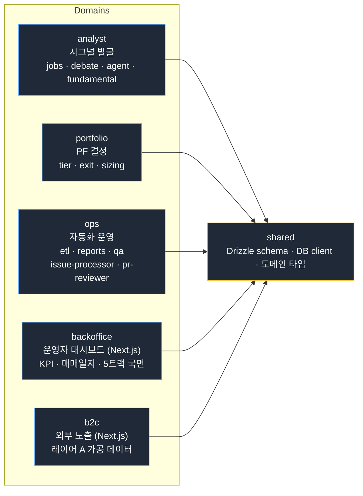
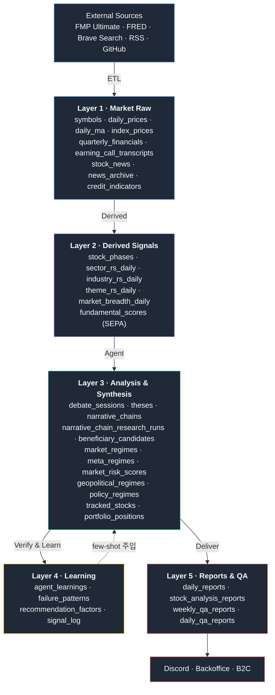

# Architecture

## 설계 원칙

1. **도메인 경계 분리** — 시그널 발굴 / PF 결정 / 자동화 운영 / 대시보드 / 외부 노출을 서로 다른 패키지로 격리.
2. **shared 단방향 의존** — 모든 패키지는 `shared`에만 의존한다. analyst가 portfolio를 직접 호출하지 않는다.
3. **DB가 인터페이스** — 도메인 간 통신은 함수 호출이 아니라 DB 테이블이다. 한 도메인이 쓰고, 다른 도메인이 읽는다. 이 구조 덕에 어느 도메인이든 독립적으로 cron으로 재실행할 수 있다.
4. **재현성** — 모든 파생 지표와 리포트는 입력 데이터만 있으면 재생성 가능해야 한다. 학습 결과는 별도 테이블에 누적.

---

## 모노레포 레이아웃

모든 도메인은 `shared`에만 단방향 의존한다. 도메인 간 직접 호출은 없고, 통신은 DB 테이블을 매개로 한다.

---

## 데이터 플로우

---

## 도메인 책임

### Analyst

시장에서 알파 후보를 발굴한다. 직접 매수/매도 결정을 내리지 않는다.

- **Phase 판정** — Stan Weinstein 4단계 모델로 종목별 사이클 단계를 매일 판정
- **RS 계산** — 종목/섹터/업종/테마 4계층의 상대강도를 가중 평균(단기 0.5 + 중기 0.3 + 장기 0.2)으로 계산
- **SEPA 스코어링** — Mark Minervini의 Specific Entry Point Analysis 기반 펀더멘탈 등급(S/A/B/C/F)
- **5인 토론** — 5개 페르소나가 RS 귀납 → 공급망 연역 → 수요-공급-병목 서사 → thesis 구조화
- **narrative chain** — megatrend → bottleneck → beneficiary 종목으로 이어지는 인과 사슬 추적
- **딥리서치** — 독립 에이전트(chain-researcher)가 외부 웹 증거로 병목 지속성 판정·수혜주 발굴, 증거를 append-only 층에 보존하고 verdict 히스테리시스로 체인 생애주기를 전이
- **하락장 선행 감지** — 4레이어 합성 리스크 스코어(일드커브 + 금융 스트레스 + 경제 사이클 + 시장 브레드스)로 드로다운 온셋을 선행 감지. 금융 스트레스를 주축 트리거로 두어 일드커브 단독 발화를 차단(HIGH는 L2 게이트 필수). 2008(+117일)·2022(+54일) 약세장 사전 포착, precision 59.6%. 현재 관찰·로깅 전용 — 전략 브리핑·대시보드에 노출되며 PF 자동 연결은 검증 후 보류
- **Phase 2 진입 정밀도 자기계측** — 핵심 가설("Phase 1→2 전환 주도주 선점")의 탐지 품질을 스스로 정량화한다. Phase 2 진입 직후 Phase 1로 되돌아가는 반락률을 배치 모니터링하고, 진입 주(week) 단위 코호트로 분해해 marginal 통과 종목(경계선 통과)의 차주 반락 시그니처를 정량화한다. 풀링 단일 비율로는 가려지던 주차별 추세와 marginal 집중이 드러난다. 게이트·룰을 변경하지 않는 읽기 전용 진단으로, 탐지 품질만 관측한다.

### Portfolio (PM)

Analyst의 시그널을 받아 모델 포트폴리오 편입/청산을 결정한다.

- 다중 게이트(기술적 + 펀더멘탈 + 직전 상태)를 통과한 종목을 featured로 격상
- 격상 게이트가 깨지면 강등, Phase Exit 조건 충족 시 청산
- 동시 보유 한도 (총 N / 섹터 N / 업종 N) 강제
- 현재 L1 룰 기반. L2 LLM 결정 단계로 진화 예정.

#### 포지션 사이징 — R 기반 결정론적 비중

진입 시점에 **절대비중**을 확정한다(구 균등가중 폐기). 모든 종목에 같은 비중을 배분하는 대신, 각 종목의 변동성에 맞춰 위험을 균등하게 배분한다.

| 파라미터 | 값 / 계산식 |
|---------|-----------|
| R (리스크 단위) | 계좌 NAV의 1% |
| 손절폭 | 2 × ATR% |
| position_size | R ÷ 손절폭% |
| 상한 (cap) | 0.15 (15%) |
| 하한 (floor) | 0.04 (4%) — 미만이면 편입 제외 |

ATR이 결손인 경우 폴백 캐스케이드: 당일 ATR → forward-fill → 업종(industry) 중앙값 → 시장 중앙값 3%.

`conviction_score`는 사이징과 분리 — 우선순위 정렬(어느 종목을 먼저 편입할지)에만 사용하고 비중 계산에는 개입하지 않는다.

**어필 포인트**: 손절폭이 넓은 고변동성 종목은 비중이 자동으로 줄고, 타이트한 저변동성 종목은 비중이 늘어난다. 같은 R(1% 리스크)을 맞추므로 종목별 손실 기여가 균등해진다.

#### 절대비중 시가평가 회계

포지션의 시장가치를 매일 재평가하되, 비중 자체는 진입 시점에 확정된 값을 유지한다.

- `posValue_i = baseValue_i × (close / entry_price)`, `baseValue_i = position_size_i × 진입시점 NAV`
- `total_assets = cash + Σ posValue` — 이 등식이 매일 성립
- `cash ≥ 0` 불변식 — 현금은 명시 추적 슬롯으로 음수가 될 수 없음
- 승자 종목의 비중은 매일 균등 재계산 없이 가격 상승에 따라 자연 증가

### Operations

도메인 간 cron 오케스트레이션과 외부 인터페이스를 담당한다.

- ETL: FMP/FRED/뉴스/어닝콜 데이터 수집
- 리포트 발행 (일간/주간/기업/QA)
- QA 게이트 3축 채점
- Issue Processor: GitHub Issue를 받아 Claude Code CLI로 PR 생성
- PR Reviewer: 열린 PR Strategic + Code 자동 리뷰

### Backoffice

Next.js 기반 운영자 대시보드. control-tower 구버전을 모노레포로 흡수했다.

- 알파 KPI: 누적 PnL vs SPY, Sharpe, 적중률
- 매매일지 UI
- 5트랙 국면 시각화 (시장 레짐 / 섹터 사이클 / 메가 사이클 / 지정학 / 정책)
- 하락 리스크 모니터 (4레이어 합성 스코어, 관찰 전용)
- 운영 헬스 대시보드

### B2C

외부 사용자에게 노출하는 서비스. 레이어 A만 가동.

- 레이어 A: 레짐, 섹터/업종 RS, 내러티브 가공 데이터 (개별 종목 거명 없음)
- 레이어 B: 종목 알파 노출 — 누적 PnL/Sharpe 선행 조건 충족 시 가동
- FMP raw 데이터(가격 OHLCV / 재무제표 raw / 어닝콜 원문)는 외부 노출 금지, 우리 가공물(RS 순위, 등급, 에이전트 콘텐츠)만 노출

---

## DB 구조 요약

84개 테이블을 8개 군으로 분류한다.

| 군 | 대표 테이블 | 책임 |
|----|-----------|------|
| 시장 원본 | daily_prices, symbols, quarterly_financials | ETL 수집 데이터 |
| 파생 지표 | stock_phases, sector_rs_daily, fundamental_scores | ETL 계산 결과 |
| 분석·추천 | tracked_stocks, portfolio_positions, signal_log | 에이전트 산출물 |
| 토론·학습 | debate_sessions, theses, agent_learnings, narrative_chains, narrative_chain_research_runs, market_risk_scores | 토론 + 딥리서치 + 학습 + 리스크 감지 |
| 리포트·QA | daily_reports, weekly_qa_reports | 발행물 + 품질 검증 |
| 기업 데이터 | company_profiles, earning_call_transcripts, eps_surprises | FMP 확장 |
| 패턴 분석 | sector_phase_events, sector_lag_patterns | 시차 패턴 |
| 백테스트 | bt_daily_rs, bt_stock_phases, bt_exit_validation_runs | 생존편향 해소 시뮬레이션 (운영 ETL과 격리) |

스키마는 Drizzle ORM으로 정의되어 있으며, `db push` 기반의 단방향 마이그레이션 흐름을 사용한다.

---

## 비기능 결정 메모

- **Suspense + ErrorBoundary** — Next.js 대시보드의 데이터 페치는 모두 Suspense 경계로 감싼다. 로딩/에러 상태를 컴포넌트마다 수동 관리하지 않는다.
- **불변성** — 모든 도메인 객체는 `Readonly<T>` 또는 `as const` 사용. 변경은 새 객체 생성.
- **Discriminated Union** — 상태 모델링은 boolean flag 대신 union 타입. 예: `ThesisStatus = 'ACTIVE' | 'HYPOTHESIS' | 'CONFIRMED' | 'INVALIDATED' | 'EXPIRED'`
- **Branded type** — symbol, accountId 같은 도메인 primitive는 brand로 컴파일 타임에 구분.
