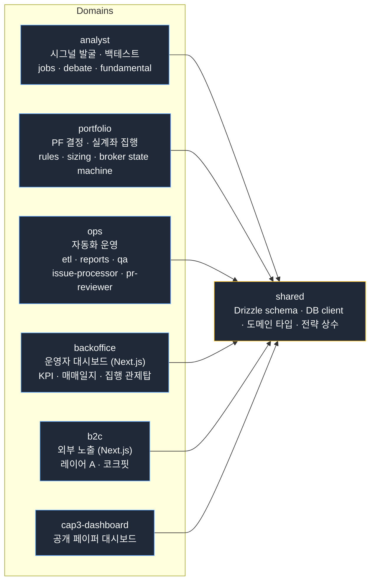
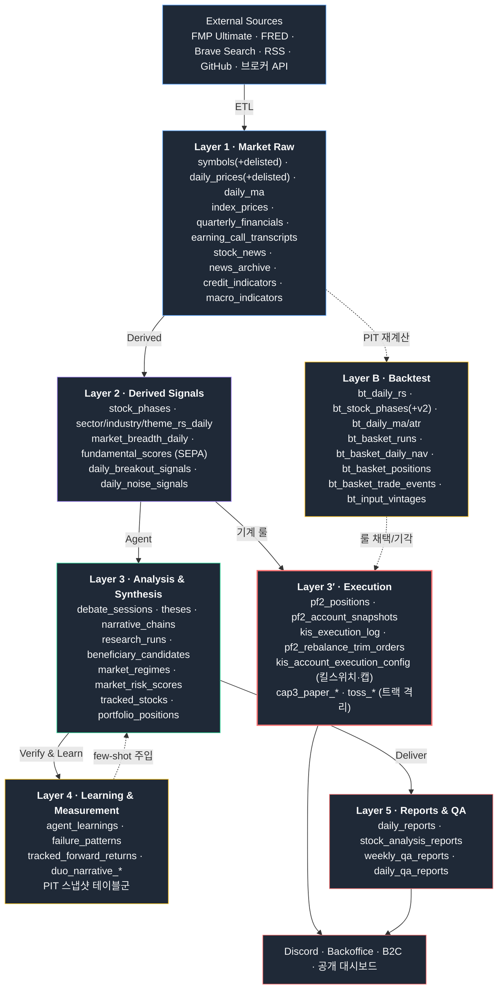

# Architecture

## 설계 원칙

1. **도메인 경계 분리** — 시그널 발굴 / PF 결정·집행 / 자동화 운영 / 대시보드 / 외부 노출을 서로 다른 패키지로 격리.
2. **shared 단방향 의존** — 모든 패키지는 `shared`에만 의존한다. analyst가 portfolio를 직접 호출하지 않는다.
3. **DB가 인터페이스** — 도메인 간 통신은 함수 호출이 아니라 DB 테이블이다. 한 도메인이 쓰고, 다른 도메인이 읽는다. 이 구조 덕에 어느 도메인이든 독립적으로 cron으로 재실행할 수 있다.
4. **재현성** — 모든 파생 지표와 리포트는 입력 데이터만 있으면 재생성 가능해야 한다.
5. **물리 분리 > 판별 컬럼** — 실자금·페이퍼·브로커별 원장은 판별 컬럼(discriminator)이 아니라 **테이블 자체를 나눈다.** 한 번의 실수로 섞이는 경로를 남기지 않기 위해서다.

---

## 모노레포 레이아웃

```mermaid
flowchart LR
    subgraph Domains
        A["analyst<br/>시그널 발굴 · 백테스트<br/>jobs · debate · fundamental"]
        P["portfolio<br/>PF 결정 · 실계좌 집행<br/>rules · sizing · broker state machine"]
        O["ops<br/>자동화 운영<br/>etl · reports · qa<br/>issue-processor · pr-reviewer"]
        B["backoffice<br/>운영자 대시보드 (Next.js)<br/>KPI · 매매일지 · 집행 관제탑"]
        C["b2c<br/>외부 노출 (Next.js)<br/>레이어 A · 코크핏"]
        D["cap3-dashboard<br/>공개 페이퍼 대시보드"]
    end
    S["shared<br/>Drizzle schema · DB client · 도메인 타입 · 전략 상수"]

    A --> S
    P --> S
    O --> S
    B --> S
    C --> S
    D --> S

    classDef domain fill:#1f2937,stroke:#60a5fa,color:#f9fafb
    classDef shared fill:#1f2937,stroke:#fbbf24,color:#f9fafb
    class A,P,O,B,C,D domain
    class S shared
```

전략 파라미터는 `shared`의 단일 SSOT에 있다. 브로커가 둘이 된 순간 `PF2_` 같은 접두사는 거짓말이 되므로, 전략 상수는 브로커 중립명으로 옮기고 옛 이름은 deprecated re-export로만 남겼다(실집행 파일의 import 라인을 실자금 직전에 건드리지 않기 위해).

---

## 데이터 플로우

```mermaid
flowchart TB
    EXT["External Sources<br/>FMP Ultimate · FRED · Brave Search · RSS · GitHub · 브로커 API"]
    L1["<b>Layer 1 · Market Raw</b><br/>symbols(+delisted) · daily_prices(+delisted) · daily_ma<br/>index_prices · quarterly_financials · earning_call_transcripts<br/>stock_news · news_archive · credit_indicators · macro_indicators"]
    L2["<b>Layer 2 · Derived Signals</b><br/>stock_phases · sector/industry/theme_rs_daily<br/>market_breadth_daily · fundamental_scores (SEPA)<br/>daily_breakout_signals · daily_noise_signals"]
    L3["<b>Layer 3 · Analysis & Synthesis</b><br/>debate_sessions · theses · narrative_chains<br/>research_runs · beneficiary_candidates<br/>market_regimes · market_risk_scores<br/>tracked_stocks · portfolio_positions"]
    LX["<b>Layer 3′ · Execution</b><br/>pf2_positions · pf2_account_snapshots<br/>kis_execution_log · pf2_rebalance_trim_orders<br/>kis_account_execution_config (킬스위치·캡)<br/>cap3_paper_* · toss_* (트랙 격리)"]
    L4["<b>Layer 4 · Learning & Measurement</b><br/>agent_learnings · failure_patterns<br/>tracked_forward_returns · duo_narrative_*<br/>PIT 스냅샷 테이블군"]
    LB["<b>Layer B · Backtest</b><br/>bt_daily_rs · bt_stock_phases(+v2) · bt_daily_ma/atr<br/>bt_basket_runs · bt_basket_daily_nav · bt_basket_positions<br/>bt_basket_trade_events · bt_input_vintages"]
    L5["<b>Layer 5 · Reports & QA</b><br/>daily_reports · stock_analysis_reports<br/>weekly_qa_reports · daily_qa_reports"]
    OUT["Discord · Backoffice · B2C · 공개 대시보드"]

    EXT -->|ETL| L1
    L1 -->|Derived| L2
    L2 -->|기계 룰| LX
    L2 -->|Agent| L3
    L1 -.PIT 재계산.-> LB
    LB -.룰 채택/기각.-> LX
    L3 -->|Verify & Learn| L4
    L4 -. few-shot 주입 .-> L3
    L3 -->|Deliver| L5
    LX --> OUT
    L5 --> OUT

    classDef raw fill:#1f2937,stroke:#60a5fa,color:#f9fafb
    classDef derived fill:#1f2937,stroke:#a78bfa,color:#f9fafb
    classDef agent fill:#1f2937,stroke:#34d399,color:#f9fafb
    classDef money fill:#1f2937,stroke:#f87171,color:#f9fafb,stroke-width:2px
    classDef learn fill:#1f2937,stroke:#fbbf24,color:#f9fafb
    classDef out fill:#1f2937,stroke:#f87171,color:#f9fafb
    class EXT,L1 raw
    class L2 derived
    class L3 agent
    class LX money
    class L4,LB learn
    class L5,OUT out
```

**Layer 3(에이전트 산출물)에서 Layer 3′(집행)로 가는 화살표가 없다.** 이건 그림을 단순화한 게 아니라 실제 구조다.

---

## 도메인 책임

### Analyst

시장에서 알파 후보를 발굴하고, 백테스트용 시점별 지표를 재계산한다. 직접 매수/매도 결정을 내리지 않는다.

- **Phase 판정** — Weinstein 4단계 모델로 종목별 사이클 단계를 매일 판정
- **RS 계산** — 종목/섹터/업종/테마 4계층의 상대강도를 가중 평균으로 계산
- **SEPA 스코어링** — Minervini 기반 펀더멘탈 등급(S/A/B/C/F). S/A가 드문 것이 의도된 설계이며, **적게 나온다고 기준을 낮추지 않는다**
- **5인 토론 / narrative chain / 딥리서치** — [Agent System](agent-system.md) 참조
- **백테스트 전용 지표 재계산** — 운영 테이블은 실시간 overwrite라 과거 시점 값이 남지 않는다. 시점별 Phase·RS·ATR·MA를 별도 테이블로 재계산해 둔다
- **PIT 스냅샷** — 라이브 overwrite 테이블(체인 수혜주, 테마 태그)의 그날 멤버십을 매일 append-only로 박제. **지금 만들지 않으면 다음 사이클의 학습 재료가 영구 손실**된다

#### 기각된 것도 자산이다 — 하락장 선행 감지

4레이어 합성 리스크 스코어(일드커브 + 금융 스트레스 + 경제 사이클 + 브레드스)로 드로다운 온셋을 선행 감지하는 장치를 만들었다. 2008(+117일)·2022(+54일) 약세장을 사전 신호로 포착했고 precision 59.6%.

그리고 **실제 포트폴리오에 연결해 A/B 백테스트를 돌린 결과, 기각했다.**

- 신규 진입 차단으로 연결 → 음성
- 보유 노출 축소로 연결 → 음성. 방어를 켠 구성이 **MDD를 오히려 악화**시켰다(−50.28% → −50.60%). 방어 장치가 자기 존재 이유를 못 했다

기각 이유를 문서에 못 박고 **재발굴 금지**로 표시했다. 선행성 지표가 좋았다고 해서 포트폴리오 성과로 이어지지 않는다는 것이 실측이다. 지표 자체는 관찰·리포트용으로 남긴다.

지수 RSI 다이버전스 천장 경고도 같은 상태다 — 백필 검증에서 lift 2.42배로 채택 문턱은 넘었지만, **판정·집행 연결은 하지 않는다.** 관찰 로그에 append-only로 쌓을 뿐이다.

### Portfolio (PM)

시그널을 편입/청산 결정으로 바꾸고, 실계좌에 집행한다. 두 개의 포트폴리오 트랙이 있다.

#### PF#1 — 모델 포트폴리오 (측정용)

- 다중 게이트를 통과한 종목을 featured로 격상, 깨지면 강등
- **청산 룰**: Hard Stop(당일 종가 ≤ 진입가 × (1 − 2×ATR%)) → Phase 3 overstay(4주) 순. 청산선은 편입 시점에 결정론적으로 박제되어 사이징의 손절폭과 정합
- **R 기반 사이징**: R(NAV의 1%) ÷ 손절폭(2×ATR%), cap 0.15 / floor 0.04. ATR 결손 시 폴백 캐스케이드(당일 → forward-fill → 업종 중앙값 → 시장 중앙값)
- **절대비중 시가평가 회계**: `total_assets = cash + Σ posValue`가 매일 성립, `cash ≥ 0` 불변식. 승자 비중은 매일 균등 재계산 없이 자연 증가

> 손절폭이 넓은 고변동성 종목은 비중이 자동으로 줄고, 타이트한 종목은 늘어난다. 같은 R을 맞추므로 종목별 손실 기여가 균등해진다. `conviction_score`는 **우선순위 정렬 전용**이며 비중 계산에 개입하지 않는다.

#### PF#2 — 실계좌 트랙 (집행용)

- Technology 섹터 Phase 2 유니버스 + 품질 게이트(최소 가격 / 달러 거래대금 / 과열 / 기울기 / 흑자 등)
- **균등비중 슬롯** 사이징(NAV ÷ 슬롯 수), 월간 리밸런싱 + 승자 부분매도(트림)
- **Phase 2 이탈 즉시 청산** — Hard Stop·Overstay 미적용(트랙마다 청산 룰이 다르며, 설정으로 분기한다)
- 브로커 집행 상태머신 → [Live Execution](live-execution.md)

두 트랙의 룰이 다른 것은 실수가 아니다. PF#1은 관찰·측정 트랙이고, PF#2는 백테스트가 검증한 룰을 그대로 집행하는 트랙이다.

### Operations

도메인 간 cron 오케스트레이션과 외부 인터페이스. ETL, 리포트 발행(일간 / 일간 초보자용 / 주간 시장 / 주간 종목 / 기업 / QA), QA 게이트, Issue Processor, PR Reviewer, 집행 감시 Sentinel.

### Backoffice

Next.js 기반 운영자 대시보드.

- **알파 KPI**: 누적 PnL vs **QQQ(메인)** · SPY(보조), Sharpe, 적중률, 재베이스 시계열
- **실집행 관제탑** (`/pf2-live`): 성과 / 보유 현황 / 매수 후보 / 집행 감시 4탭. **읽기 전용** — 화면에서 주문을 낼 수 없다
- **매수 후보 탭**: 그날 스크리닝한 전 종목의 게이트별 통과/탈락 사유. 화면이 잡을 다시 돌리지 않고 **박제된 스냅샷만 읽는다**(재계산하면 "화면 ≠ 잡이 본 것"이 되므로, 회귀 테스트가 다른 테이블 참조를 차단)
- 5트랙 국면 시각화, 마켓 리스크 게이지, 백테스트 통합 탐색기, 매크로 검증 작업대

### B2C

레이어 A(레짐·섹터/업종 RS·내러티브 가공 데이터, 개별 종목 거명 없음)와 레이어 0 코크핏이 가동 중. 레이어 B(종목 알파 노출)는 성과 게이트 충족 전까지 가동 금지. FMP raw 데이터는 외부 노출 금지, 우리 가공물만 노출한다.

---

## DB 구조 요약

**146개 테이블**을 9개 군으로 분류한다.

| 군 | 대표 테이블 | 책임 |
|----|-----------|------|
| 시장 원본 | daily_prices(+delisted), symbols(+delisted), quarterly_financials | ETL 수집 데이터 |
| 파생 지표 | stock_phases, sector/industry/theme_rs_daily, fundamental_scores | ETL 계산 결과 |
| 분석·추천 | tracked_stocks, portfolio_positions, tracked_forward_returns | 에이전트 산출물 + 고정-호라이즌 팩터 검증 |
| 토론·학습 | debate_sessions, theses, agent_learnings, narrative_chains, market_risk_scores | 토론 + 딥리서치 + 학습 + 리스크 관찰 |
| **집행 원장** | pf2_positions, pf2_account_snapshots, kis_execution_log, kis_account_execution_config | 실계좌 상태머신 · 주문 원장 · 킬스위치 SSOT |
| **트랙 격리** | pf2b_*, toss_*, cap3_paper_* | 계좌·브로커·페이퍼 트랙별 물리 분리 |
| 리포트·QA | daily_reports, weekly_qa_reports, daily_qa_reports | 발행물 + 품질 검증 |
| 기업 데이터 | company_profiles, earning_call_transcripts, earning_calendar | FMP 확장 |
| 백테스트 | bt_basket_runs, bt_basket_daily_nav, bt_basket_trade_events, bt_input_vintages | 생존편향 해소 시뮬레이션 (운영 ETL과 격리) |

스키마는 Drizzle ORM으로 정의하고, **번호순 SQL 마이그레이션**으로 생애주기를 관리한다. 스키마와 인벤토리 문서의 drift는 CI가 차단한다.

### 마이그레이션에서 배운 것

- **적용 순서를 역전하면 라이브가 멈춘다.** 새 컬럼을 무조건 참조하는 코드를 먼저 배포하면, 마이그레이션 적용 전까지 그 잡이 전건 실패한다. 폴백을 두지 않는 것은 의도다(조용히 틀린 값보다 시끄러운 실패가 낫다) — 대신 **배포 순서를 문서 최상단에 적는다**.
- **`ADD COLUMN IF NOT EXISTS`의 인라인 CHECK는 컬럼이 이미 있으면 생성되지 않는다.** 문장 전체가 스킵되기 때문이다. 그래서 CHECK는 조건부 블록으로 분리한다.
- **번호 충돌은 실제로 자주 난다.** 여러 세션이 병렬로 작업하므로, PR의 새 마이그레이션 번호를 origin/main과 교차 대조해 충돌 시 CI를 실패시키는 가드를 뒀다.
- **"라이브 미적용"이라는 문서 서술을 믿지 않는다.** 인용 전에 `schema_migrations`와 `information_schema`를 직접 조회한다 — 문서가 틀렸던 사례가 반복됐다.

---

## 비기능 결정 메모

- **Suspense + ErrorBoundary** — 대시보드 데이터 페치는 모두 Suspense 경계로 감싼다.
- **불변성** — 도메인 객체는 `Readonly<T>` 또는 `as const`. 변경은 새 객체 생성.
- **Discriminated Union** — 상태 모델링은 boolean flag 대신 union 타입.
- **Branded type** — symbol, accountId 같은 도메인 primitive는 brand로 컴파일 타임에 구분.
- **계약 테스트** — 주석으로 적은 경고는 장치가 아니다. "이 파일은 저 테이블을 참조하면 안 된다", "이 상수는 저 CHECK와 같아야 한다" 같은 불변식은 **테스트로 고정**하고, 그 테스트가 실제로 발화하는지 변이(mutation)로 검증한다.
