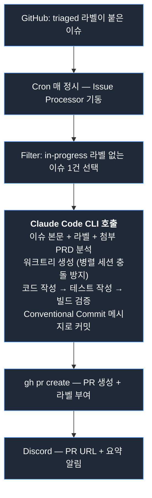
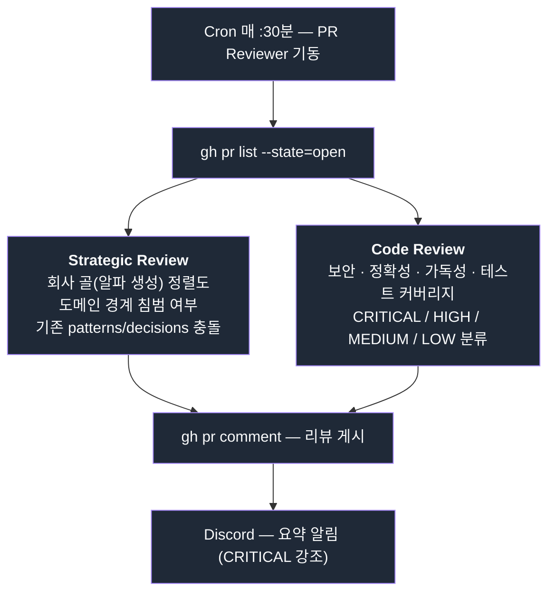
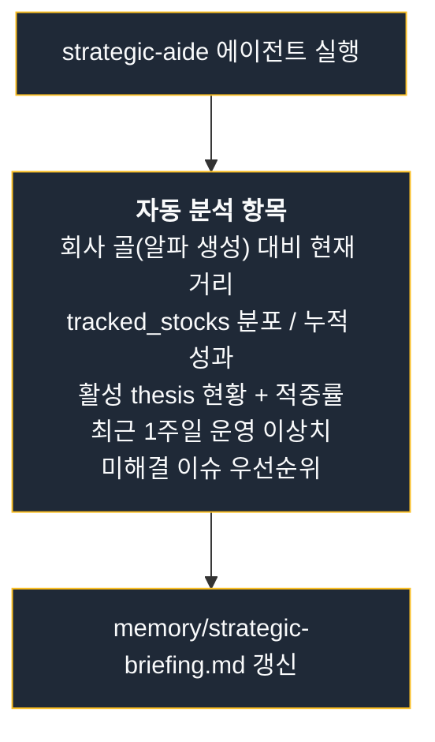

# Autonomous Operations

이 시스템은 사람이 손대지 않아도 매일 돌아가도록 설계됐다. 데이터 파이프라인뿐 아니라 **엔지니어링 작업 자체**(이슈 → PR → 리뷰)도 자동화되어 있다.

---

## 호스팅 환경

**맥미니 1대.**

- macOS의 `launchd`를 cron 대용으로 사용
- 24/7 가동, Tailscale로 원격 접근
- 같은 머신에서 ETL · 에이전트 · 이슈 프로세서 · PR 리뷰어 · 백오피스 dev 서버가 모두 실행
- Discord webhook으로 모든 작업 결과/실패 알림

클라우드 배포가 아닌 이유: 비용 + 모든 컴포넌트가 같은 머신에 있을 때 디버깅이 단순하다. 트래픽이 늘면 옮길 수 있다.

---

## launchd cron 전체 스케줄

| 작업 | KST 스케줄 | 트리거 빈도 |
|------|-----------|------------|
| ETL Daily | 07:00 화~토 | 일 1회 |
| ETL Weekly | 08:00 일 | 주 1회 |
| ETL Monthly | 07:30 매월 1일 | 월 1회 (테마 태그 전체 재분류) |
| News Collect | 06:45, 18:00 매일 | 일 2회 |
| Issue Triage | 09:00 매일 | 일 1회 |
| Issue Processor | 매 정시 10:00~02:00 | **일 17회** |
| PR Reviewer | 매 :30분 09:30~02:30 | **일 18회** |
| Strategic Review | 04:00 매일 | 일 1회 |
| Chain Researcher | 05:00 금 | 주 1회 (딥리서치 run→apply→evaluate) |
| Agent Weekly | 10:00 토 | 주 1회 (주간 리포트 시장·종목 2건) |
| QA Weekly | 12:00 토 | 주 1회 (알파 KPI 무결성 포함) |
| System Audit | 06:00 토 | 주 1회 (데이터·스케줄 문서 정합 감사) |
| Component Review | 06:00 일 | 주 1회 (컴포넌트 자가 점검) |
| Visual QA | 07:00 일 | 주 1회 (리포트 HTML 시각 검증) |
| Log Cleanup | 09:00 일 | 주 1회 |
| Claude Update | 05:00 일 | 주 1회 (CLI 자동 업데이트) |
| Backoffice Health | 5분 주기 | **일 288회** |
| Backoffice Deploy | 03:00 매일 | 일 1회 (origin/main 변경 시) |
| Backoffice E2E | 05:30 매일 | 일 1회 (13페이지 스모크) |
| B2C Deploy | 04:30 매일 | 일 1회 (origin/main 변경 시) |

---

## ETL Daily 파이프라인

ETL Daily는 6단계로 구성된다. 각 단계가 직전 단계의 DB 결과에 의존하므로 순차 실행이지만, 각 단계 내부에서는 종목/섹터/업종 단위로 병렬 처리.

```
1. Price/Volume 수집 (FMP)
        ↓
2. Phase 판정 + MA 계산
        ↓
3. RS 계산 (종목 → 섹터 → 업종 → 테마)
        ↓
4. 브레드스 + SEPA 스코어링
        ↓
5. 5인 토론 + thesis 검증
        ↓
6. 일간 리포트 생성 + QA + Discord 발행
```

QA가 `block` 판정하면 발행이 차단되고 GitHub Discussions Alert이 자동 게시된다. 다음날 사람이 검토.

---

## Issue Processor: 자동 코드 작성 파이프라인

GitHub Issue를 받아 Claude Code CLI가 코드를 작성하고 PR을 만든다.



### 안전장치

- 이슈 라벨 화이트리스트로만 실행 (`auto-implement` 등)
- 워크트리 격리로 메인 작업과 충돌 차단
- 빌드/테스트 실패 시 PR 생성하지 않음
- 머지는 절대 자동 안 함. CEO만 머지 권한.

### 운영 결과

이 시스템이 가동된 이후 단순 개선/버그픽스 이슈의 80% 이상이 사람 코드 작성 없이 PR까지 도달한다. CEO는 리뷰와 머지만 한다.

---

## PR Reviewer: 자동 리뷰 파이프라인

열린 PR을 30분마다 스캔해 자동 리뷰한다.



리뷰 결과는 항상 인라인 코멘트 + 요약 코멘트로 게시된다. Issue Processor가 만든 PR도 동일한 리뷰를 받으므로 자체 견제 구조가 성립한다.

---

## Strategic Review: 매일 04:00

매일 새벽 4시에 시스템 전체 상태를 분석해 매니저용 브리핑을 생성한다.



매니저는 새 세션 시작 시 이 파일을 자동 로드해 의사결정에 반영한다. 세션이 바뀌어도 맥락이 유지되는 핵심 메커니즘.

### 룰 변경 후보의 듀얼 게이트 검증

Strategic Review에서 발견된 룰 변경 처방 후보는 IS(In-Sample) + OOS(Out-of-Sample) **듀얼 게이트**를 통과해야만 채택한다. 둘 다 `GUARD_JUSTIFIED` 판정일 때만 실제 룰에 반영한다.

실제 사례: 섹터 RS 약세 가드를 추가하는 처방이 OOS(2025-01~2026-05) 단독으로는 유의(p_adj 0.002)했으나, IS(2023-06~2024-12) 데이터를 더하자 재현에 실패해 **기각**됐다. OOS에서만 유효하게 보이던 신호가 더 긴 기간의 IS 데이터 앞에서 데이터마이닝으로 판명된 케이스다. "효과 있어 보이는 신호도 IS 검증을 통과하지 못하면 버린다"는 규율을 시스템 수준에서 강제한다.

또 다른 사례: 청산 룰 디테일 3후보(하드 스탑 폭·오버스테이 기간 등)를 IS/OOS 듀얼 게이트로 백테스트한 결과 전 후보가 INCONCLUSIVE로 판정돼 **전량 기각**하고 현행 청산 룰을 유지했다. "청산 룰을 바꾸면 나아질 것 같다"는 직관이 검증 앞에서 근거 없음으로 확인된 케이스로, 검증 실패 시 *변경하지 않는 것*이 기본값임을 보여준다.

---

## 매니저-에이전트 협업 프로토콜

미션 수행은 정해진 11단계 프로토콜을 따른다.

1. **기획** — `mission-planner`에 위임. 기획서 없이 구현 금지.
2. **기획서 검증** — 매니저가 6개 기준으로 검토 (불필요한 제약, 타이밍 충돌, 근거 없는 숫자, 리소스 경합, 순차/병렬 판단, 기존 시스템 간섭)
3. **자율 판단** — 기획서 내 의사결정은 매니저+mission-planner가 조율
4. **PO 위임 분기** — 단일 컴포넌트는 매니저 직접 / 부서 다수 에이전트 협업은 PO 경유
5. **워크트리 생성** — 병렬 세션 간 브랜치 충돌 방지
6. **디스패치** — 독립 작업은 병렬
7. **코드 리뷰** — `code-reviewer` 실행, CRITICAL/HIGH 수정
8. **문서 업데이트** — README/ROADMAP/wiki 자동 판단
9. **PR 생성** — `pr-manager`에 위임 (직접 gh pr create 금지)
10. **PR 보고 + 대기** — CEO에게 URL 보고 후 정지
11. **머지는 CEO 지시 시에만** — 리뷰 통과 여부와 무관

이 프로토콜은 `CLAUDE.md`에 정의되어 있고, 모든 새 Claude Code 세션이 자동 로드한다.

---

## 모니터링 / 알림

| 채널 | 용도 |
|------|------|
| Discord (운영) | cron 성공/실패, 리포트 발행, PR 생성 알림 |
| Discord (알람) | Backoffice 다운, QA block, 매크로 이상 신호 |
| GitHub Discussions | QA block 발생 시 자동 Alert 게시 |
| GitHub Issues | strategic-aide가 감지한 시스템 이상 자동 issue 생성 |

`memory/MEMORY.md`에 운영 피드백을 누적해 매니저가 같은 실수를 반복하지 않도록 한다.

---

## 자율성의 경계

자동화하지 않은 것 — **머지**, **자금 집행**.

- 머지 권한은 CEO에게만. 리뷰 통과·테스트 통과 여부와 무관.
- 모델 포트폴리오는 가상 PF이며, 실거래 집행은 시스템 외부.
- B2C 레이어 B(개별 종목 매수 후보 노출)는 누적 PnL / Sharpe 선행 조건 충족 전까지 가동 금지.

자율성과 안전성의 균형을 의도적으로 설계했다.
