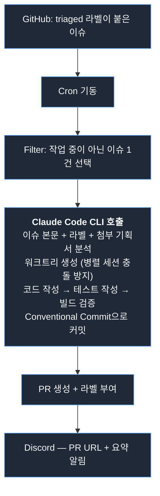
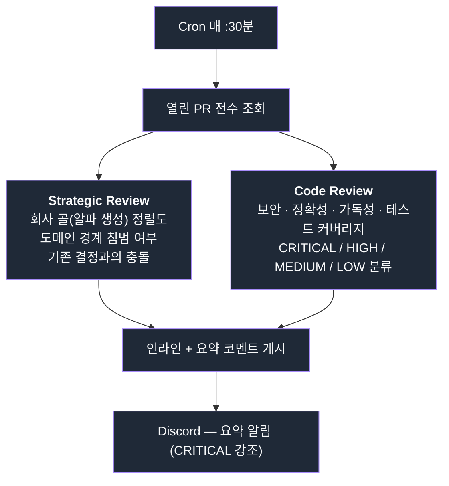

# Autonomous Operations

이 시스템은 사람이 손대지 않아도 매일 돌아가도록 설계됐다. 데이터 파이프라인과 **실계좌 집행**뿐 아니라, **엔지니어링 작업 자체**(이슈 → PR → 리뷰)도 자동화되어 있다.

---

## 호스팅 환경 — 머신 3대

| 머신 | 역할 | 왜 분리했나 |
|------|------|------------|
| **맥미니** | 프로덕션 — launchd cron 42종, ETL, 에이전트, 실계좌 집행, 대시보드 서버 | 24/7 가동. 모든 컴포넌트가 한 곳에 있어 로그 추적이 단순 |
| **맥북에어** | 백테스트 전용 | 백테스트의 부하 주체는 Node가 아니라 PostgreSQL이다. 운영 머신에서 돌리면 **실주문·체결 확인 cron이 밀린다** — 그건 매매 기회 손실 |
| **맥북(작업)** | 개발 | 백테스트를 여기서 돌렸더니 푸시 훅의 전체 테스트가 DB 타임아웃으로 무더기 실패해 **모든 세션의 push가 막혔다** |

머신 간 접근은 Tailscale로 묶고, 외부 노출은 하지 않는다. 모든 작업 결과/실패는 Discord webhook으로 알린다.

클라우드가 아닌 이유: 비용 + 디버깅 단순성. 트래픽이 늘면 옮길 수 있다. 다만 **부하 성격이 다른 워크로드는 이미 분리했다** — "한 대로 충분하다"는 판단은 실측으로 깨졌다.

---

## launchd cron — 42종

### 데이터 & 분석

| 작업 | KST 스케줄 | 내용 |
|------|-----------|------|
| ETL Daily | 화~토 10:00 | 6단계 파이프라인 전체 (미국 종가 +5h로 이동해 EOD sweep 완성 후 수집) |
| ETL Weekly | 일 08:00 | 분기 재무·비율·SEPA 스코어링·기업 프로필 갱신 |
| ETL Monthly | 매월 1일 07:30 | 테마 태그 전체 재분류 |
| News Collect | 매일 06:45, 18:00 | 매크로/종목 뉴스 + 테마 추출 |
| Chain Researcher | 금 05:00 | 내러티브 병목 딥리서치 (run → apply → evaluate) |
| Cockpit Snapshot / Planner | 화~토 15:35 / 15:50 | B2C 코크핏 일별 스냅샷 → 그 화면을 채점해 다음 기획 이슈 생성 |

### 실계좌 집행 (자세히: [Live Execution](live-execution.md))

| 작업 | KST 스케줄 | 내용 |
|------|-----------|------|
| T7a 주문 예약 | 화~토 04:30 (EDT) | 미국 마감 30분 전 재검증 → 지정가 주문 |
| 트림 주문 예약 | 화~토 04:40 (EDT) | 월간 리밸 승자 부분매도 (MOC) |
| 정합성 대조 | 화~토 06:30 | 브로커 잔고 ↔ DB 포지션 대조 |
| stuck 감시 | 화~토 06:35 | 6개 감시축, 순수 DB SELECT (브로커 API 호출 0회) |
| 포지션 갱신 | 화~토 11:45 | Phase 2 이탈 판정 → 청산 대기 전이 |
| 진입 평가 | 화~토 12:15 | 후보 스크리닝 + 후보 스냅샷 박제 |
| T7b 체결 확인 | 화~토 14:00 | 체결가 원자적 확정 → ACTIVE / EXITED |
| 자산 스냅샷 | 화~토 14:15 | 실계좌 NAV 일별 아카이브 |
| 체결품질 집계 | 화~토 14:20 | 슬리피지·체결률·거부율 (계측 전용, 브로커 API 미호출) |
| 노출방어 신호 관찰 | 화~토 14:25 | 섀도우 NAV + 신호 7종 (**집행 미연결**) |
| 일간 다이제스트 | 화~토 14:30 | 편입/청산 이벤트 + α/NAV 요약 Discord 발송 |
| 월간 리밸런싱 | 매월 1일 12:00 | 청산 → 재가중 → 편입, 단일 트랜잭션 |
| 집행 감시 Sentinel | 15분 주기 | 필수 잡 등록·freshness 감시. 이탈 시 CRITICAL 전용 채널 |

⚠️ **DST 전환은 수동이다.** launchd에 자동 조정이 없어, 미국 서머타임 종료 시 관련 plist의 Hour를 **동시에** 옮겨야 한다. 한쪽만 밀면 트림이 본 주문보다 먼저 도는 순서 역전이 생긴다. 이 사실을 런북 최상단에 적어 뒀다.

### 엔지니어링 자동화

| 작업 | KST 스케줄 | 내용 |
|------|-----------|------|
| Issue Triage | 매일 09:00 | 미분류 이슈 배치 트리아지 + 차단 라벨 자동 복귀 |
| Issue Processor | 매시 :00 (13~17, 19~02, **일 13회**) | triaged 이슈 → Claude Code CLI 구현 → PR 생성 |
| PR Reviewer | 매시 :30 (09~02, **일 18회**) | 열린 PR 전수 Strategic + Code 리뷰 |
| Strategic Review | 매일 04:00 | 전략 브리핑 자동 갱신 |
| System Audit | 토 06:00 | 데이터·코드·스케줄 문서 정합 감사 → 이슈 자동 생성 |
| Component Review | 일 06:00 | 컴포넌트 자가 점검 → advisory 이슈 |
| Visual QA | 일 07:00 | 리포트 HTML 스크린샷 시각 검증 |

> 시간대 배치는 우연이 아니다. Issue Processor가 10~12시를 비우는 이유는 ETL 가동창과 git mutation 게이트가 경합하기 때문이고, 18:00을 비우는 이유는 뉴스 수집과 Claude CLI를 다투기 때문이다. **경합 회피 근거를 스케줄 표에 각주로 남긴다** — 이유를 모르면 다음 사람이 되돌린다.

### 리포트 & 인프라

Agent Weekly(토 13:30) / QA Weekly(토 14:30) / CAP3 시그널(화~토 12:25) / CAP3 공개 대시보드 발행(화~토 12:45) / Backoffice Health(5분) / Backoffice Deploy(03:00) / B2C Deploy(04:30) / Backoffice E2E(05:30) / Log Cleanup / Claude Update / pm2 복원.

---

## Issue Processor: 자동 코드 작성 파이프라인

```mermaid
flowchart TB
    A["GitHub: triaged 라벨이 붙은 이슈"]
    B["Cron 기동"]
    C["Filter: 작업 중이 아닌 이슈 1건 선택"]
    D["<b>Claude Code CLI 호출</b><br/>이슈 본문 + 라벨 + 첨부 기획서 분석<br/>워크트리 생성 (병렬 세션 충돌 방지)<br/>코드 작성 → 테스트 작성 → 빌드 검증<br/>Conventional Commit으로 커밋"]
    E["PR 생성 + 라벨 부여"]
    F["Discord — PR URL + 요약 알림"]

    A --> B --> C --> D --> E --> F

    classDef step fill:#1f2937,stroke:#60a5fa,color:#f9fafb
    class A,B,C,D,E,F step
```

### 안전장치

- 이슈 라벨 화이트리스트로만 실행
- 워크트리 격리 + 격리된 레포 클론으로 메인 작업과 충돌 차단
- 빌드/테스트 실패 시 PR 생성하지 않음
- **머지는 절대 자동 안 함**

### 그리고 자동화를 믿지 않는 장치

자동 PR 본문의 "CRITICAL 0건"은 **자기 신고**다. 리뷰 도구가 실행 자체에 실패해도 본문은 그렇게 적힌다. 그래서 PR을 받을 때 리뷰 결과를 **별도로 조회**해 검증한다 — 리뷰가 아예 없었던 PR을 "클린"으로 읽는 사고가 실제로 있었다.

작업 중인 이슈를 여러 머신·여러 워크트리에서 추적하기 위해, 어떤 이슈가 어디서 열려 있는지를 DB에 기록하는 세션 원장도 두고 있다(로컬 디렉터리 이름으로만 추정하던 것을 대체).

---

## PR Reviewer: 자동 리뷰 파이프라인

```mermaid
flowchart TB
    A["Cron 매 :30분"]
    B["열린 PR 전수 조회"]
    SR["<b>Strategic Review</b><br/>회사 골(알파 생성) 정렬도<br/>도메인 경계 침범 여부<br/>기존 결정과의 충돌"]
    CR["<b>Code Review</b><br/>보안 · 정확성 · 가독성 · 테스트 커버리지<br/>CRITICAL / HIGH / MEDIUM / LOW 분류"]
    P["인라인 + 요약 코멘트 게시"]
    D["Discord — 요약 알림 (CRITICAL 강조)"]

    A --> B
    B --> SR
    B --> CR
    SR --> P
    CR --> P
    P --> D

    classDef step fill:#1f2937,stroke:#a78bfa,color:#f9fafb
    class A,B,SR,CR,P,D step
```

Issue Processor가 만든 PR도 동일한 리뷰를 받으므로 자체 견제 구조가 성립한다.

**리뷰가 사람보다 나은 순간이 실제로 있었다.** 함수 시그니처를 유지한 채 의미만 바꾼 변경에서, 자동 리뷰가 diff에 드러나지 않는 호출부 파급을 짚어 매니저의 2라운드 검토를 이겼다. 반대로 리뷰가 진단은 맞고 처방은 틀린 경우도 있어서, **처방을 그대로 적용하지 않고 근거를 직접 재현**하는 절차를 둔다.

---

## Strategic Review: 매일 04:00

시스템 전체 상태를 분석해 매니저용 브리핑을 생성한다 — 회사 골 대비 현재 거리, 관찰 종목 분포, 활성 thesis 현황, 최근 운영 이상치, 미해결 이슈 우선순위.

매니저는 새 세션 시작 시 이 파일을 자동 로드한다. **세션이 바뀌어도 맥락이 유지되는 핵심 메커니즘.**

### 룰 변경 후보의 듀얼 게이트 검증

Strategic Review에서 나온 룰 변경 처방은 IS(In-Sample) + OOS(Out-of-Sample) **듀얼 게이트**를 통과해야만 채택한다.

실제 사례: 섹터 RS 약세 가드 추가 처방이 OOS 단독으로는 유의(p_adj 0.002)했으나, IS 데이터를 더하자 재현에 실패해 **기각**됐다. OOS에서만 유효해 보이던 신호가 더 긴 기간 앞에서 데이터마이닝으로 판명된 케이스다.

또 다른 사례: 청산 룰 3후보를 듀얼 게이트로 백테스트한 결과 전 후보가 INCONCLUSIVE로 판정돼 **전량 기각**하고 현행을 유지했다. **검증 실패 시 "변경하지 않는 것"이 기본값**임을 시스템 수준에서 강제한다.

---

## 매니저-에이전트 협업 프로토콜

1. **기획** — `mission-planner`에 위임. 기획서 없이 구현 금지
2. **기획서 검증** — 매니저가 6개 기준으로 검토 (불필요한 제약, 타이밍 충돌, 근거 없는 숫자, 리소스 경합, 순차/병렬 판단, 기존 시스템 간섭)
3. **자율 판단** — 기획서 내 의사결정은 매니저+플래너가 조율
4. **PO 위임 분기** — 단일 컴포넌트는 직접 / 부서 다수 협업은 PO 경유
5. **워크트리 생성** — 병렬 세션 간 브랜치 충돌 방지
6. **디스패치** — 독립 작업은 병렬
7. **코드 리뷰** — CRITICAL/HIGH 수정
8. **문서 업데이트** — README/ROADMAP/wiki 자동 판단
9. **PR 생성** — `pr-manager`에 위임
10. **PR 보고 + 자동 검증** — 리뷰를 CI보다 **먼저** 판정한다. 리뷰가 코드 변경을 유발하면 그 사이 도는 CI 결과는 재푸시로 무효화되므로, CI 완료를 미리 기다리는 것은 낭비다
11. **머지는 CEO 지시 시에만**

이 프로토콜은 `CLAUDE.md`에 정의되어 있고, 모든 새 세션이 자동 로드한다.

### 규율은 사고에서 나온다

매니저가 반복한 실수는 메모리 파일에 누적되고, 그중 재발이 잦은 것은 **훅이나 계약 테스트로 승격**된다.

- "상태 변경을 위임했으면 조회로 확인하라" — 에이전트가 "위임했다"고만 답하고 실제로는 아무 일도 일어나지 않은 적이 있다. **보고문은 의도이지 사실이 아니다.**
- "조사 명령의 0건은 부재의 증거가 아니다" — 앞 명령이 죽어도 0건이 나오고, 틀릴 때 항상 "문제 없음" 쪽으로 틀린다.
- "강제하기 전에 측정하라" — 어떤 상한 훅이 막는 경로를 실제로 쓰는 코드가 0건이었다. 억제 효과 0에 오차단만 남아 계측으로 되돌렸다.

---

## 모니터링 / 알림

| 채널 | 용도 |
|------|------|
| Discord (운영) | cron 성공/실패, 리포트 발행, PR 생성 알림 |
| Discord (CRITICAL 전용) | 집행 잡 이탈, 미체결, 정합성 불일치 — **신호 대 잡음비를 지키기 위해 분리** |
| Discord (알람) | Backoffice 다운, QA block, 매크로 이상 신호 |
| GitHub Discussions | QA block 발생 시 자동 Alert |
| GitHub Issues | 자동 감사가 감지한 시스템 이상 자동 이슈 생성 |

**이 시스템의 고장은 에러가 아니라 침묵으로 온다.** 알림이 "잡 실패"만 덮으면 "성공했는데 틀린" 경우를 아무도 보지 않는다. 그래서 새 알림을 만들 때는 *정상일 때 조용한 것*까지 완료 조건에 넣는다.

---

## 자율성의 경계

자동화한 것과 하지 않은 것을 명시적으로 나눈다.

**자동화한 것**
- 데이터 수집 → 분석 → 리포트 → QA → 발행
- **실계좌 진입·청산 주문 집행** (기계 룰 단독, LLM 미개입)
- 이슈 → 코드 작성 → PR 생성 → 리뷰

**자동화하지 않은 것**
- **머지** — 리뷰 통과·테스트 통과 여부와 무관하게 CEO 전속
- **킬스위치 해제** — DB 트리거가 사유 기재를 강제하고, 변경은 append-only 감사 원장에 남는다
- **집행 캡 상향, 새 계좌·브로커 활성화** — 두 번째 계좌는 주문 잡 미등록 + 요청 계층 차단으로 이중 봉인
- **B2C 레이어 B(개별 종목 노출)** — 누적 성과 게이트 충족 전까지 가동 금지

자율성과 안전성의 균형을 의도적으로 설계했다. **가장 되돌리기 어려운 행동일수록 사람에게 남긴다.**
