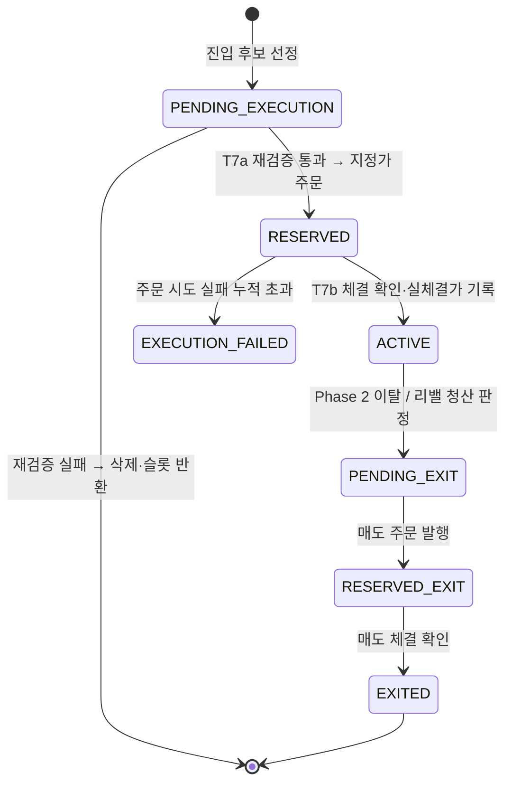

# Live Execution — 실계좌 자동 집행

2026-08-04부터 이 시스템은 **가상 포트폴리오가 아니라 실계좌**를 다룬다. 한국투자증권(KIS) OpenAPI로 미국 주식을 주문하고, 체결을 확인하고, 상태를 전이시키는 전 과정이 launchd cron으로 무인 구동된다.

단, **주문이 실제로 나가는지는 사람이 쥔 킬스위치가 결정한다.** 잠근 동안에도 후보 스크리닝·관측·원장·정합성 감시는 그대로 돌아간다 — 집행을 멈추는 것과 시스템을 멈추는 것은 다른 일이다.

> **목적은 알파 입증이 아니라 집행 인프라 검증이다.** 2단계 사이클 doctrine상 지금은 수집 단계 — 소액으로 "주문이 의도대로 나가고, 체결이 원장에 정확히 남고, 사고 시 스스로 멈추는가"를 확인하는 것이 이 트랙의 KPI다.

---

## 가장 중요한 설계 결정: LLM은 이 경로에 없다

진입·청산 판단은 **100% 결정론적 기계 룰**이다. 토론 페르소나·thesis·narrative chain·market regime은 이 경로를 한 줄도 참조하지 않는다.

| | 참조함 | 참조 안 함 |
|---|---|---|
| 진입 후보 | Phase 판정, RS, MA/기울기, 거래대금, 흑자 여부, 섹터 | thesis, narrative chain, 토론 합의, 레짐 판정 |
| 청산 | Phase 2 이탈 (결정론 룰) | LLM 재량 판단 |
| 사이징 | NAV / 슬롯 수 (균등비중) | conviction score, 서사 강도 |

`portfolio_positions`에 `thesis_id`·`narrative_chain_id` 컬럼이 있지만 **컨빅션 표시용 스냅샷이지 게이트가 아니다.** 이 경계는 문서가 아니라 계약 테스트로 고정된다 — 실행 파일 4종(`pf2-reserve-orders` / `pf2-confirm-fills` / `rebalance-pf2-monthly` / 룰 모듈)의 소스에 관찰용 테이블 이름이 등장하면 테스트가 실패한다.

**왜 이렇게 했나.** LLM 판단은 재현되지 않는다. 같은 입력에 다른 출력이 나오면 백테스트가 라이브를 예측하지 못하고, 사후에 "왜 샀는가"를 답할 수 없다. 서사는 리포트에서 사람이 읽는 값이고, 돈은 재현 가능한 룰이 움직인다.

---

## 집행 상태머신

포지션은 7개 상태를 가진다. 실전 계좌에서 `ACTIVE`는 **실제 체결이 확인된 뒤에만** 붙는다.

### T7a — 주문 예약 (미국 마감 30분 전)

전날 선정된 후보를 **그대로 사지 않는다.** 마감 직전 현재가로 진입 조건을 다시 평가한다.

- 현재가가 장기 이동평균 위인가 / 이동평균 기울기가 양인가 / 과열(froth) 임계 이내인가
- 통과 → 현재가 기준 지정가 주문 발행 → `RESERVED` + 주문번호(ODNO)·주문일 기록
- 실패 → 행 삭제(슬롯 반환). **주문 시도 실패만** 재시도 카운터를 올리고, 평가 자체의 오류는 보류로 남긴다

> 후보 선정과 주문 발행 사이에는 하루 가까운 시차가 있다. 그 사이에 조건이 깨진 종목을 그대로 사면 백테스트가 검증한 룰과 다른 것을 집행하게 된다.

### T7b — 체결 확인 (개장 직후)

- `RESERVED` → 브로커 체결 조회 → 체결가로 `entry_price`를 **원자적 UPDATE**(`WHERE entry_price IS NULL`) 후 `ACTIVE`
- `RESERVED_EXIT` → `EXITED`
- **미체결이면 재주문하지 않는다.** 보류 + CRITICAL 알림. 중복 체결보다 미집행이 안전하다는 방향 선택이다.

실전 포지션은 `entry_price NULL`로 삽입된다. 자산 스냅샷 잡이 `WHERE entry_price IS NOT NULL`로 거르므로, **체결 전 포지션이 NAV에 섞이는 경로가 구조적으로 없다.**

---

## 안전장치

전부 **fail-closed**다. 판단이 불가능하면 주문을 내지 않는 쪽으로 떨어진다.

| 장치 | 동작 |
|------|------|
| 킬스위치 | DB 단일 행. ON이면 매수·매도 전부 차단. 조회 실패도 차단(fail-closed) |
| 킬스위치 감사 원장 | 변경이 append-only 원장에 자동 기록. **해제 시 사유 신규 기재를 DB 트리거가 강제** — 안 쓰면 해제 자체가 거부된다 |
| 집행 캡 | 건당 상한 / 일간 총액 상한 (매수 전용, NULL이면 NAV 기반 동적 산출). 매도는 별도 sanity 상한 |
| 슬롯 회계 | 비종결 포지션 전부를 슬롯으로 계산 — `RESERVED`가 슬롯을 안 잡아 발생하던 크로스데이 이중매수를 봉합 |
| 중복 주문 가드 | (계좌, 종목, 매매구분, 한국시각 날짜) 부분 유니크 인덱스 |
| 모호 주문 차단 | 주문 요청은 갔는데 응답이 유실된 경우 `unknown` 상태로 기록하고, **날짜 무관 fail-closed로 동일 종목 재주문을 막는다**. 사람이 브로커 기록으로 해소할 때까지 자동 재개 없음 |
| 어포더빌리티 필터 | 정수주만 주문 가능하므로, 슬롯 예산보다 비싼 종목은 선정 시점에 제외하고 다음 후보로 대체(신호 순서 불변) |
| 현금 가드 | 주문가능금액 조회 후 초과 주문 차단. 레버리지 금지 — 현금이 0이면 진입 0 |
| Sentinel | 집행 잡의 launchd 등록·최근 실행 신선도를 상시 감시. 이탈 시 CRITICAL 전용 채널로 알림 |
| 정합성 대조 | 브로커 잔고 ↔ DB 포지션 주기 대조. 수동 매매·입출금·부분체결 드리프트 감지 |

### 잔여 현금은 그냥 남긴다

슬롯에 딱 맞지 않아 남는 현금을 반올림하거나 다른 종목으로 채우지 않는다. 그렇게 하면 신호가 흐려지고 백테스트와 어긋난다. **드래그를 줄이는 유일한 깔끔한 방법은 시드를 키우는 것**이라고 결론 내렸다.

---

## 다계좌 — 물리 분리 원칙

두 번째 KIS 계좌(대조군 전략)와 두 번째 브로커(토스)를 추가하면서 **공통 추상화(BrokerAdapter)를 의도적으로 기각**했다.

> 이중화의 목적은 독립 장애다. 공통 레이어에 버그가 생기면 양쪽이 동시에 무너진다. 그러면 이중화한 의미가 없다.

그래서:

- 브로커마다 **독립 파일·독립 테이블·독립 advisory lock**. 기존 KIS 코드는 0줄 수정.
- 계좌마다 **독립 자격증명·킬스위치·집행 캡**. 한 계좌를 잠가도 다른 계좌는 영향받지 않는다.
- 페이퍼 트랙 행이 실자금 회계에 섞이지 않도록 **테이블 자체를 분리**. 판별 컬럼(discriminator)을 쓰지 않는 이유는, 실수 한 번이면 섞이기 때문이다.

현재 트랙 구성:

| 트랙 | 상태 | 성격 |
|------|------|------|
| KIS 계좌1 | 자동 집행 가동 | 메인 전략. 진입·청산·리밸 전 경로 자동 |
| KIS 계좌2 | **읽기 전용 관측만** | 대조군 전략. 주문 잡 9종 미등록 + 요청 계층에서 `ACCOUNT_ACTION_DISABLED`로 이중 차단 |
| CAP3 시그널 채널 | 페이퍼 + 알림 | 자동매매 아님. Discord로 매수·청산·리밸 알림만 발송, 보유는 원장 가정으로 추적. 공개 페이퍼 대시보드 자동 발행 |
| 토스증권 | **무기한 홀딩** | 인프라는 보존, launchd 미등록. 미등록이 결함으로 오인돼 되켜지지 않도록 문서에 명시 |

---

## 이 트랙에서 배운 것

**"코드 완성"과 "집행 준비 완료"는 다른 말이다.** 매수 상태머신·안전장치가 전부 완결된 시점에 "완성"이라고 보고했는데, 감사해 보니 **매도 경로에 상태 전이 writer가 0개**였다. 사는 것만 되고 파는 것이 안 되는 상태로 실전에 들어갈 뻔했다.

이후 규칙이 생겼다 — 참조 구현(백테스트 엔진)과 라이브 집행을 **통째로 대조**하고, "완성" 선언 전에 readiness 감사를 별도로 돌린다. 본질적 결함을 "후속 이슈"로 격하하지 않는다.

**계측되지 않는 것은 개선되지 않는다.** 체결 품질(슬리피지)을 측정하려 했더니, 원장에 "신호 발생 시점가"가 없어서 주문가에서 역산해야 했다. 역산은 마크업 상수를 바꾸는 순간 깨지고, 주문 유형이 바뀌면 의미 자체가 사라진다. 그래서 신호가를 **기록 시점에 사실로 남기는** 컬럼을 추가했다 — 추측이 아니라 관측으로.

그리고 그 계측이 알려준 것은 예상과 달랐다: **지정가 주문은 불리한 슬리피지가 구조적으로 관측되지 않는다**(불리하면 미체결로 전환되므로). 한쪽이 절단된 표본의 평균을 기준선으로 쓰면 집행 비용을 체계적으로 과소평가한다. 그래서 그 행들은 평균에서 제외하고, 제외 사유를 코드에 명시한다.
